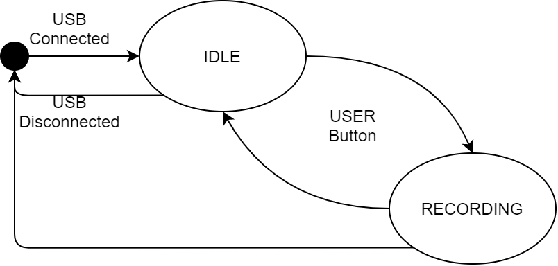

# Reporting S41 | Projet Traitement de signal audio embarqué temps-réél sur carte STM32

*Ven. 15/10/21 17:17*

Bonjour,  

Cette semaine, j’ai avancé sur plusieurs points :  

 - Recherche sur l’utilisation de la puce de SDRAM de la carte :

Mes recherches ont conclu que la bibliothèque de la librairie HAL nous interfaçant avec le contrôleur SDRAM n’est pas fonctionnelle. Dans mes tentatives j’ai réussi à développer un programme qui faisait « sauter » le pointeur programme en dehors du programme en utilisant les fonctions misent à disposition de la librairie.  

 - Recherche sur l’utilisation du port USB OTG de la carte :

Ne pouvant pas me servir de la SDRAM pour stocker des captures plus longues, je me suis penché sur l’utilisation du port USB OTG et d’une clé USB. Cependant, la documentation de la carte indique que le port micro-USB type B intégré est relié à l’interface USB_FS. Or pour que les bons signaux soient mappés dans CubeMX il faut utiliser l’interface USB_HS  

- Intégration des sources du démonstrateur au dépôt Git

Ces sources sont stockées dans le dossier 04_Embedding/demonstrateur_playback  

Il intègre une machine d’état similaire à celle présentée dans le reporting de la semaine 39  

Pendant l’état playback le programme joue le même son sur les deux canaux du DAC permettant d’avoir une sortie dédiée pour l’écouteur gauche et le droit.  

- Création d’un démonstrateur d’enregistrement sur clé USB

Ce démonstrateur utilise la machine d’état suivante :  

 

Il permet d’enregistrer des extraits audios de longue durée, pour l’instant je ne gère pas la saturation de l’espace disque USB   

Cordialement,

**Pierre-Yves JÉZÉGOU**

FIPA 2021
