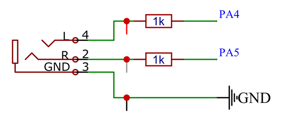
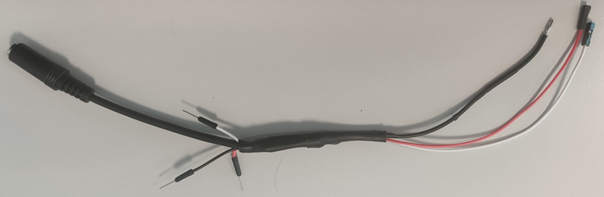

# Reporting S41* | Projet Traitement de signal audio embarqué temps-réél sur carte STM32

 *Ven. 22/10/21 17:10*

Bonjour,

Cette semaine, j’ai travaillé sur les points suivants :

 - Création d’un programme pour la carte qui reproduit en temps réel les sons captés par le microphone sur les deux canaux du DAC.

- Travail sur la partie permettant de brancher un casque sur le DAC :

Après quelques recherches quant à l’étage de puissance nécessaire à la connexion d’un casque, j’ai trouvé un article qui utilise le même microcontrôleur que nous, pour créer une carte son Ethernet. Dans cet article l’auteur indique, qu’une résistance de 1 kΩ limite suffisamment le courant pour ne pas occasionner de dégât au DAC. Hypothèse que j’ai vérifiée via la documentation du microcontrôleur qui indique que le courant maximum qui peut être délivré par une sortie est de 25 mA. Avec une résistance de 1 kΩ en amont du casque le courant de sortie maximum (casque en court-circuit) sur les sorties du DAC est de 3 mA quand la sortie du DAC réglé sur 3V (valeur maximum). J’ai donc fait le choix de charger chacune des sorties du DAC avec une résistance de 1 kΩ (1/4 W) en amont de la prise Jack

Cela nous donne le schéma électrique suivant :

J'ai donc fabriqué le câble suivant

Le câble suit le code couleur RCA pour ses canaux (Rouge : gauche, Blanc : droit), sauf pour le noir qui correspond à la masse.

Les fils (Blanc, Rouge, et Noir) mâles permettent de surveiller les niveaux électriques aux bornes du casque.  

<ul>
    <li>
        Travail sur les démonstrateurs
        <ul>
            <li>
                Changement de nom :
                <ul>
                    <li>démonstrateur playback -> parrot : car comme le perroquet il répète ce qu'il entend
                    <li>démonstrateur digital recorder -> digital recoder
                </ul>
            </li>
            <li>
                Ajout d'un programme reproduisant en temps réel le son capté sur le DAC (direct output)
            </li>
            <li>
                Les programmes "digital recorder" et "direct output" capture maintenant les sons à 48 kHz
            </li>
        </ul>
    </li>
    <li>    
        Documentations de mes travaux
    </li>
</ul>

Cordialement,

**Pierre-Yves JÉZÉGOU**

FIPA 2021

*\* Copier collé malheureux lors de l'envoi du reporting de la Semaine 42 l'objet de l'email n'a pas été actualisé...*
