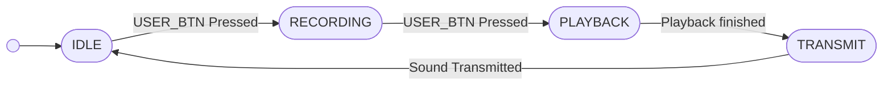
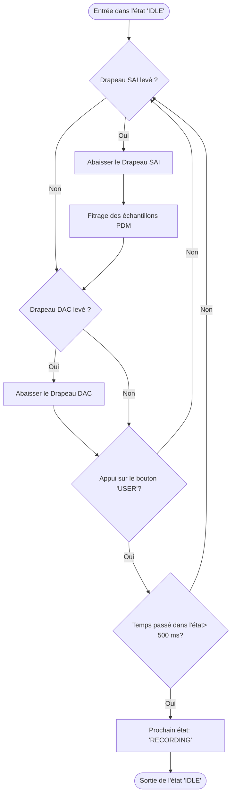
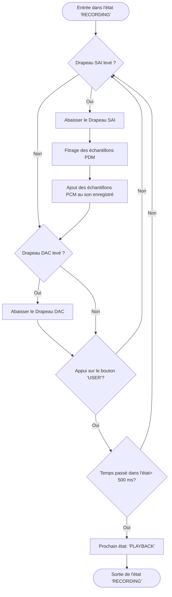
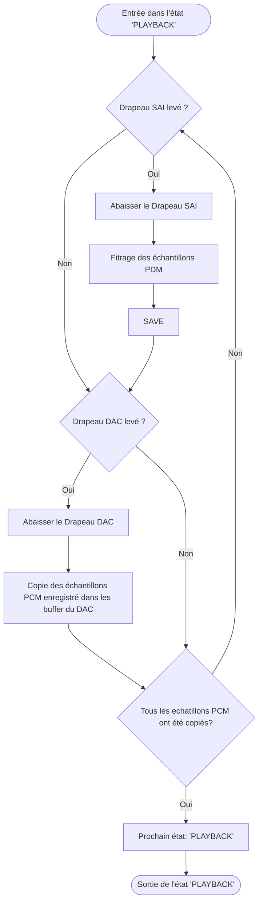
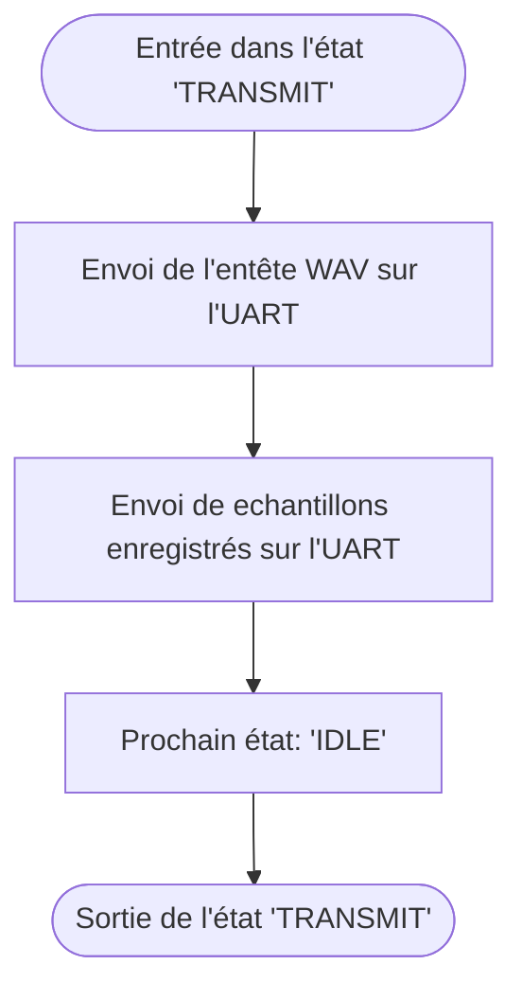

# Annexe 1:  Logigrammes des États démonstrateur "Parrot"
## Machine détat

```mermaid

graph LR;
    INIT(( ));
    IDLE([IDLE]);
    RECORDING([RECORDING]);
    PLAYBACK([PLAYBACK])
    TRANSMIT([TRANSMIT])

    INIT --> IDLE;

    IDLE -->| USER_BTN Pressed | RECORDING;

    RECORDING -->| USER_BTN Pressed | PLAYBACK;

    PLAYBACK --> | Playback finished | TRANSMIT

    TRANSMIT -->| Sound Transmitted | IDLE;

```
## IDLE

```mermaid
graph TD
    INIT(["Entrée dans l'état 'IDLE'"])
    FINISH(["Sortie de l'état 'IDLE'"])

    SAI_FLAG{"Drapeau SAI levé ?"};
    FILTER["Fitrage des échantillons PDM"];
    RESET_SAI_FLAG["Abaisser le Drapeau SAI"]

    DAC_FLAG_UP{"Drapeau DAC levé ?"}
    RESET_DAC_FLAG["Abaisser le Drapeau DAC"]

    USER_BTN_PRESSED{"Appui sur le bouton 'USER'?"};

    TIME_IN_STATE{"Temps passé dans l'état> 500 ms?"}

    NEXT_STATE["Prochain état: 'RECORDING'"] --> FINISH;

    INIT --> SAI_FLAG;
    SAI_FLAG -->|"Non"| DAC_FLAG_UP;
    SAI_FLAG -->|"Oui"| RESET_SAI_FLAG;
    RESET_SAI_FLAG -->FILTER;
    FILTER --> DAC_FLAG_UP;

    DAC_FLAG_UP -->|"Oui"| RESET_DAC_FLAG
    RESET_DAC_FLAG --> USER_BTN_PRESSED;
    DAC_FLAG_UP --> |"Non"| USER_BTN_PRESSED;

    USER_BTN_PRESSED -->|"Oui"| TIME_IN_STATE;
    TIME_IN_STATE --> |"Oui"| NEXT_STATE;

    USER_BTN_PRESSED -->|"Non"| SAI_FLAG;
    TIME_IN_STATE -->|"Non"| SAI_FLAG;
```

## RECORDING

```mermaid

graph TD
    INIT(["Entrée dans l'état 'RECORDING'"])
    FINISH(["Sortie de l'état 'RECORDING'"])

    SAI_FLAG{"Drapeau SAI levé ?"};
    FILTER["Fitrage des échantillons PDM"];
    SAVE["Ajout des échantillons PCM au son enregistré"]
    RESET_SAI_FLAG["Abaisser le Drapeau SAI"]

    DAC_FLAG_UP{"Drapeau DAC levé ?"}
    RESET_DAC_FLAG["Abaisser le Drapeau DAC"]

    USER_BTN_PRESSED{"Appui sur le bouton 'USER'?"};

    TIME_IN_STATE{"Temps passé dans l'état> 500 ms?"}

    NEXT_STATE["Prochain état: 'PLAYBACK'"] --> FINISH;

    INIT --> SAI_FLAG;
    SAI_FLAG -->|"Non"| DAC_FLAG_UP;
    SAI_FLAG -->|"Oui"| RESET_SAI_FLAG;
    RESET_SAI_FLAG -->FILTER;
    FILTER --> SAVE -->DAC_FLAG_UP;

    DAC_FLAG_UP -->|"Oui"| RESET_DAC_FLAG
    RESET_DAC_FLAG --> USER_BTN_PRESSED;
    DAC_FLAG_UP --> |"Non"| USER_BTN_PRESSED;

    USER_BTN_PRESSED -->|"Oui"| TIME_IN_STATE;
    TIME_IN_STATE --> |"Oui"| NEXT_STATE;

    USER_BTN_PRESSED -->|"Non"| SAI_FLAG;
    TIME_IN_STATE -->|"Non"| SAI_FLAG;
```

## PLAYBACK

```mermaid

graph TD
    INIT(["Entrée dans l'état 'PLAYBACK'"])
    FINISH(["Sortie de l'état 'PLAYBACK'"])

    SAI_FLAG{"Drapeau SAI levé ?"};
    FILTER["Fitrage des échantillons PDM"];
    RESET_SAI_FLAG["Abaisser le Drapeau SAI"]

    DAC_FLAG_UP{"Drapeau DAC levé ?"}
    RESET_DAC_FLAG["Abaisser le Drapeau DAC"];
    COPY_DAC["Copie des échantillons PCM enregistré dans les buffer du DAC"];

    PLAYBACK_FINNISHED{"Tous les echatillons PCM ont été copiés?"};


    NEXT_STATE["Prochain état: 'PLAYBACK'"] --> FINISH;

    INIT --> SAI_FLAG;
    SAI_FLAG -->|"Non"| DAC_FLAG_UP;
    SAI_FLAG -->|"Oui"| RESET_SAI_FLAG;
    RESET_SAI_FLAG -->FILTER;
    FILTER --> SAVE -->DAC_FLAG_UP;

    DAC_FLAG_UP -->|"Oui"| RESET_DAC_FLAG;
    RESET_DAC_FLAG --> COPY_DAC;
    COPY_DAC --> PLAYBACK_FINNISHED;
    DAC_FLAG_UP --> |"Non"| PLAYBACK_FINNISHED;

    PLAYBACK_FINNISHED -->|"Oui"| NEXT_STATE;

    PLAYBACK_FINNISHED -->|"Non"| SAI_FLAG;
```

## TRANSMIT

```mermaid

graph TD
    INIT(["Entrée dans l'état 'TRANSMIT'"]);
    FINISH(["Sortie de l'état 'TRANSMIT'"]);
    SEND_WAV_HEADER["Envoi de l'entête WAV sur l'UART"];
    SEND_PCM["Envoi de echantillons enregistrés sur l'UART"];
    NEXT_STATE["Prochain état: 'IDLE'"] --> FINISH;

    INIT --> SEND_WAV_HEADER;
    SEND_WAV_HEADER --> SEND_PCM;
    SEND_PCM --> NEXT_STATE;
```
