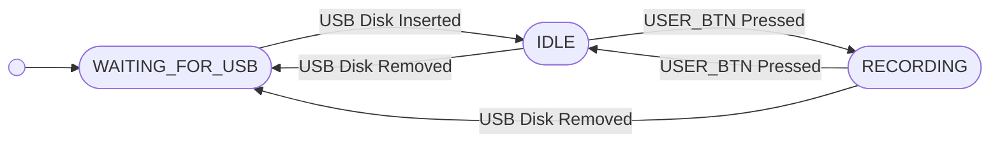
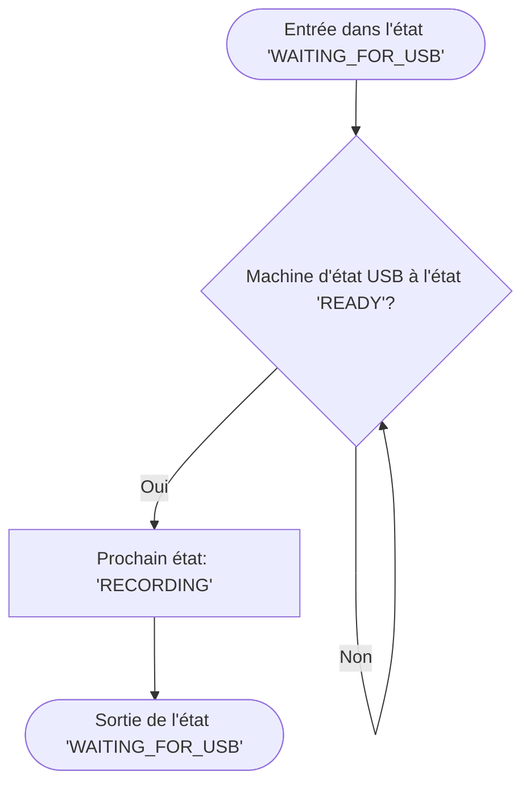
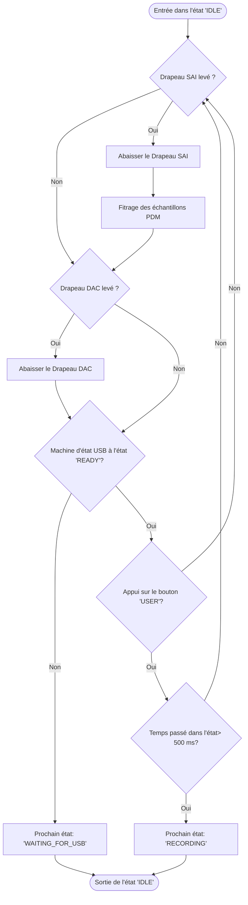
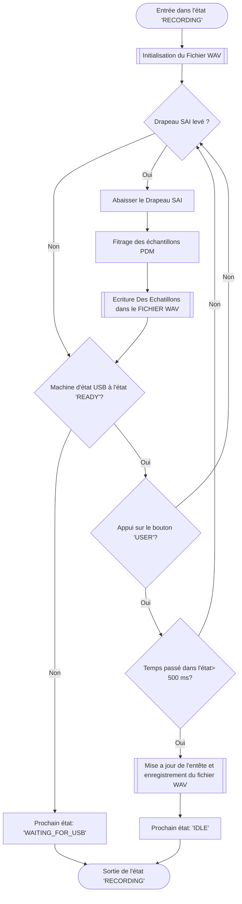

# Annexe 2:  Logigrammes des États démonstrateur "Digital Recorder"

## Machine détat

```mermaid
graph LR;
    INIT(( ));
    WAITING_FOR_USB([WAITING_FOR_USB])
    IDLE([IDLE]);
    RECORDING([RECORDING]);
    INIT --> WAITING_FOR_USB;

    WAITING_FOR_USB -->|USB Disk Inserted| IDLE

    IDLE -->| USER_BTN Pressed | RECORDING;
    IDLE -->|USB Disk Removed| WAITING_FOR_USB

    RECORDING -->| USER_BTN Pressed | IDLE;
    RECORDING -->|USB Disk Removed| WAITING_FOR_USB
```

## WAITING_FOR_USB

``` mermaid
graph TD
    INIT(["Entrée dans l'état 'WAITING_FOR_USB'"])
    FINISH(["Sortie de l'état 'WAITING_FOR_USB'"])

    CHECK_USB{"Machine d'état USB à l'état 'READY'?"}

    NEXT_STATE["Prochain état: 'RECORDING'"] --> FINISH;

    INIT --> CHECK_USB;
    CHECK_USB --> |"Oui"| NEXT_STATE;
    CHECK_USB --> |"Non"| CHECK_USB;

```

## IDLE

```mermaid

graph TD
    INIT(["Entrée dans l'état 'IDLE'"])
    FINISH(["Sortie de l'état 'IDLE'"])

    SAI_FLAG{"Drapeau SAI levé ?"};
    FILTER["Fitrage des échantillons PDM"];
    RESET_SAI_FLAG["Abaisser le Drapeau SAI"]

    DAC_FLAG_UP{"Drapeau DAC levé ?"}
    RESET_DAC_FLAG["Abaisser le Drapeau DAC"]

    USER_BTN_PRESSED{"Appui sur le bouton 'USER'?"};

    TIME_IN_STATE{"Temps passé dans l'état> 500 ms?"}

    CHECK_USB{"Machine d'état USB à l'état 'READY'?"}

    NEXT_STATE["Prochain état: 'RECORDING'"] --> FINISH;
    NEXT_STATE_U["Prochain état: 'WAITING_FOR_USB'"] --> FINISH;

    INIT --> SAI_FLAG;
    SAI_FLAG -->|"Non"| DAC_FLAG_UP;
    SAI_FLAG -->|"Oui"| RESET_SAI_FLAG;
    RESET_SAI_FLAG -->FILTER;
    FILTER --> DAC_FLAG_UP;

    DAC_FLAG_UP -->|"Oui"| RESET_DAC_FLAG
    RESET_DAC_FLAG --> CHECK_USB;
    DAC_FLAG_UP --> |"Non"| CHECK_USB;

    USER_BTN_PRESSED -->|"Oui"| TIME_IN_STATE;
    TIME_IN_STATE --> |"Oui"| NEXT_STATE;

    USER_BTN_PRESSED -->|"Non"| SAI_FLAG;
    TIME_IN_STATE -->|"Non"| SAI_FLAG;

    CHECK_USB -->|"Non"| NEXT_STATE_U;
    CHECK_USB -->|"Oui"| USER_BTN_PRESSED;

```

## RECORDING

```mermaid

graph TD
    INIT(["Entrée dans l'état 'RECORDING'"])
    FINISH(["Sortie de l'état 'RECORDING'"])

    INIT_WAV[["Initialisation du Fichier WAV"]];
    WRITE_WAV[["Ecriture Des Echatillons dans le FICHIER WAV"]]
    FINISH_WAV[["Mise a jour de l'entête et enregistrement du fichier WAV"]]

    SAI_FLAG{"Drapeau SAI levé ?"};
    FILTER["Fitrage des échantillons PDM"];
    RESET_SAI_FLAG["Abaisser le Drapeau SAI"]

    USER_BTN_PRESSED{"Appui sur le bouton 'USER'?"};

    TIME_IN_STATE{"Temps passé dans l'état> 500 ms?"}

    CHECK_USB{"Machine d'état USB à l'état 'READY'?"}

    NEXT_STATE["Prochain état: 'IDLE'"] --> FINISH;
    NEXT_STATE_U["Prochain état: 'WAITING_FOR_USB'"] --> FINISH;


    INIT --> INIT_WAV --> SAI_FLAG;
    SAI_FLAG -->|"Non"| CHECK_USB;
    SAI_FLAG -->|"Oui"| RESET_SAI_FLAG;
    RESET_SAI_FLAG -->FILTER;
    FILTER --> WRITE_WAV;
    WRITE_WAV -->CHECK_USB;


    USER_BTN_PRESSED -->|"Oui"| TIME_IN_STATE;
    TIME_IN_STATE --> |"Oui"| FINISH_WAV --> NEXT_STATE;

    USER_BTN_PRESSED -->|"Non"| SAI_FLAG;
    TIME_IN_STATE -->|"Non"| SAI_FLAG;

    CHECK_USB -->|"Non"| NEXT_STATE_U;
    CHECK_USB -->|"Oui"| USER_BTN_PRESSED;
```
