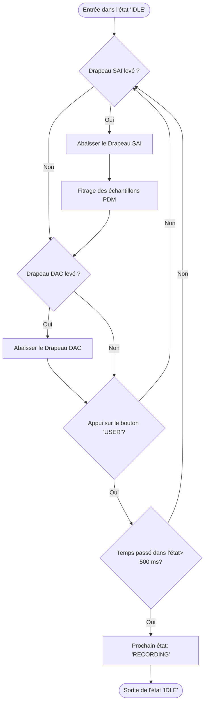
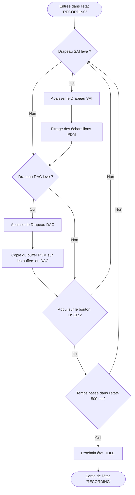

# Annexe 3:  Logigrammes des États démonstrateur "Direct Output"
## Machine détat

```mermaid

graph LR;
    INIT(( ));
    IDLE([IDLE]);
    RECORDING([RECORDING]);
    INIT --> IDLE;

    IDLE -->| USER_BTN Pressed | RECORDING;

    RECORDING -->| USER_BTN Pressed | IDLE;

```
## IDLE

```mermaid

graph TD
    INIT(["Entrée dans l'état 'IDLE'"])
    FINISH(["Sortie de l'état 'IDLE'"])

    SAI_FLAG{"Drapeau SAI levé ?"};
    FILTER["Fitrage des échantillons PDM"];
    RESET_SAI_FLAG["Abaisser le Drapeau SAI"]

    DAC_FLAG_UP{"Drapeau DAC levé ?"}
    RESET_DAC_FLAG["Abaisser le Drapeau DAC"]

    USER_BTN_PRESSED{"Appui sur le bouton 'USER'?"};

    TIME_IN_STATE{"Temps passé dans l'état> 500 ms?"}

    NEXT_STATE["Prochain état: 'RECORDING'"] --> FINISH;

    INIT --> SAI_FLAG;
    SAI_FLAG -->|"Non"| DAC_FLAG_UP;
    SAI_FLAG -->|"Oui"| RESET_SAI_FLAG;
    RESET_SAI_FLAG -->FILTER;
    FILTER --> DAC_FLAG_UP;

    DAC_FLAG_UP -->|"Oui"| RESET_DAC_FLAG
    RESET_DAC_FLAG --> USER_BTN_PRESSED;
    DAC_FLAG_UP --> |"Non"| USER_BTN_PRESSED;

    USER_BTN_PRESSED -->|"Oui"| TIME_IN_STATE;
    TIME_IN_STATE --> |"Oui"| NEXT_STATE;

    USER_BTN_PRESSED -->|"Non"| SAI_FLAG;
    TIME_IN_STATE -->|"Non"| SAI_FLAG;
```

## RECORDING

```mermaid

graph TD
    INIT(["Entrée dans l'état 'RECORDING'"])
    FINISH(["Sortie de l'état 'RECORDING'"])

    SAI_FLAG{"Drapeau SAI levé ?"};
    FILTER["Fitrage des échantillons PDM"];
    RESET_SAI_FLAG["Abaisser le Drapeau SAI"]

    DAC_FLAG_UP{"Drapeau DAC levé ?"}
    RESET_DAC_FLAG["Abaisser le Drapeau DAC"];
    COPY_DAC["Copie du buffer PCM sur les buffers du DAC"];

    USER_BTN_PRESSED{"Appui sur le bouton 'USER'?"};

    TIME_IN_STATE{"Temps passé dans l'état> 500 ms?"}


    NEXT_STATE["Prochain état: 'IDLE'"] --> FINISH;

    INIT --> SAI_FLAG;
    SAI_FLAG -->|"Non"| DAC_FLAG_UP;
    SAI_FLAG -->|"Oui"| RESET_SAI_FLAG;
    RESET_SAI_FLAG -->FILTER;
    FILTER --> DAC_FLAG_UP;

    DAC_FLAG_UP -->|"Oui"| RESET_DAC_FLAG;
    RESET_DAC_FLAG --> COPY_DAC;
    COPY_DAC --> USER_BTN_PRESSED;
    DAC_FLAG_UP --> |"Non"| USER_BTN_PRESSED;

    USER_BTN_PRESSED -->|"Oui"| TIME_IN_STATE;
    TIME_IN_STATE --> |"Oui"| NEXT_STATE;

    USER_BTN_PRESSED -->|"Non"| SAI_FLAG;
    TIME_IN_STATE -->|"Non"| SAI_FLAG;
```
