# Table des Annexes

[TOC]

# Annexe 1:  Logigrammes des États du démonstrateur "Parrot"

## Machine d'état

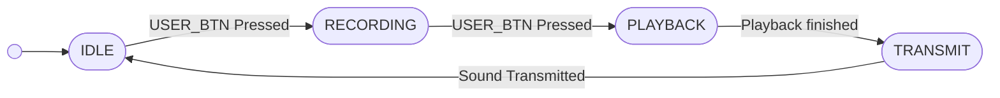

## IDLE

## RECORDING

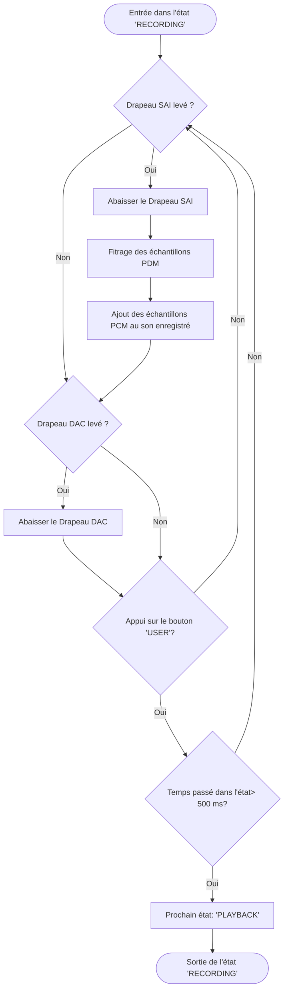

## PLAYBACK

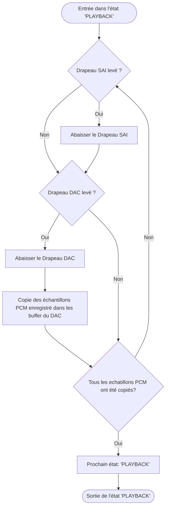

## TRANSMIT

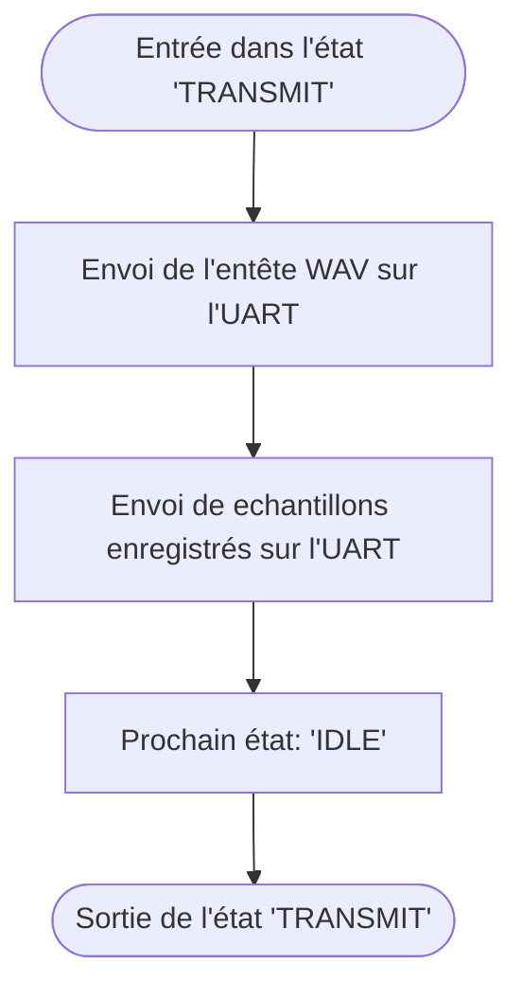

# Annexe 2:  Logigrammes des États du démonstrateur "Digital Recorder"

## Machine d'état

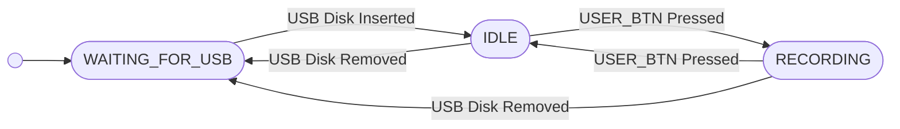

## WAITING_FOR_USB

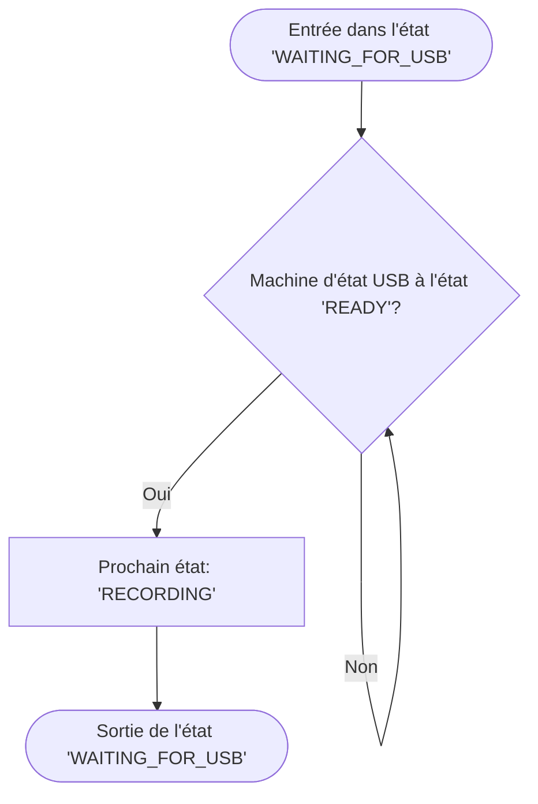

## IDLE

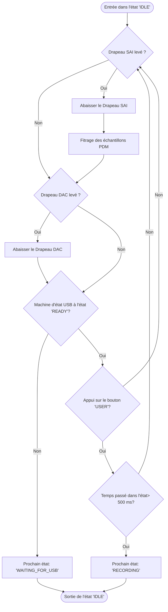

## RECORDING

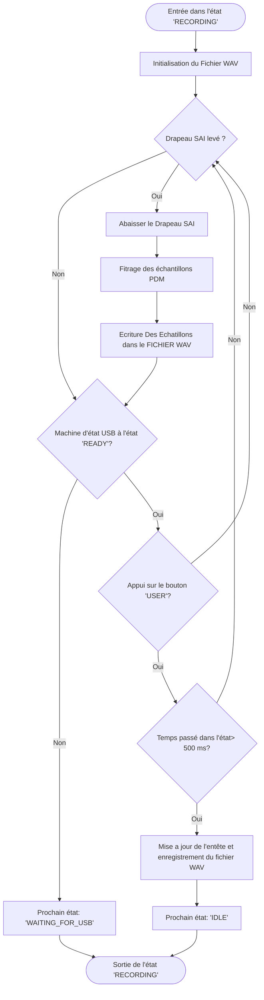

# Annexe 3:  Logigrammes des États du démonstrateur "Direct Output"

## Machine d'état

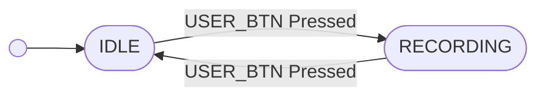

## IDLE

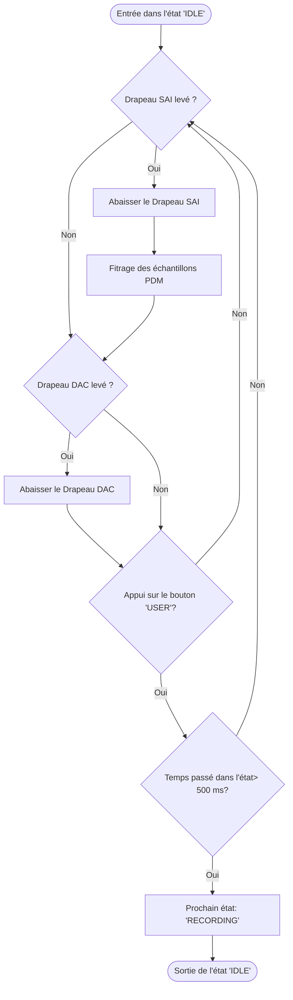

## RECORDING

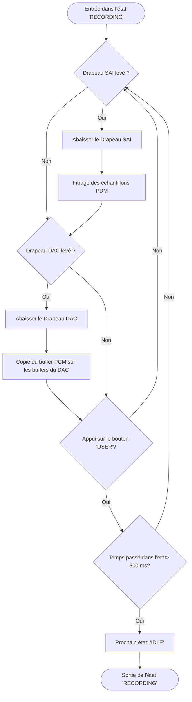