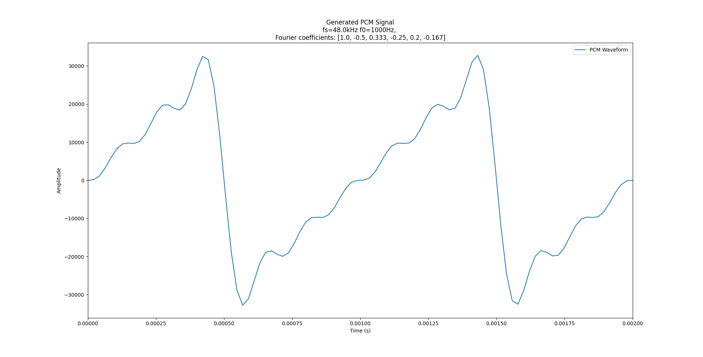
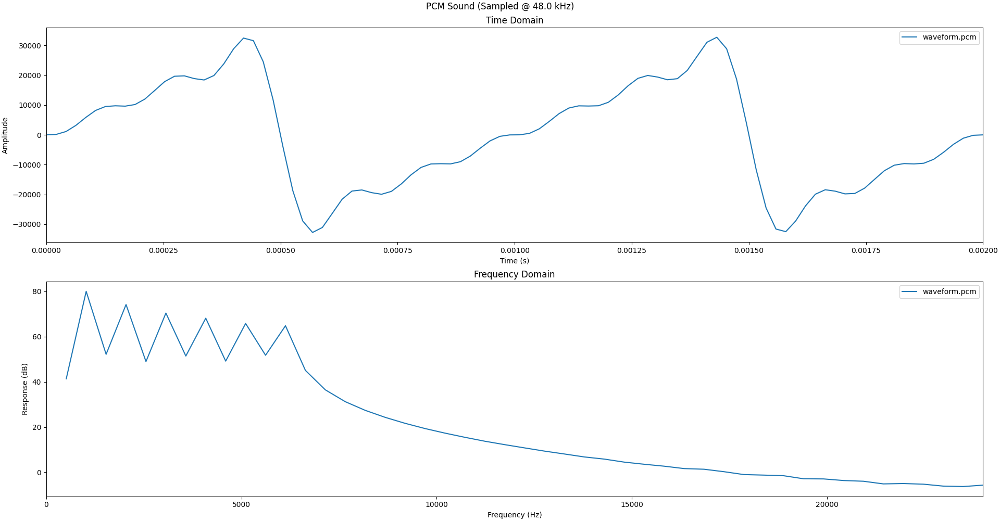
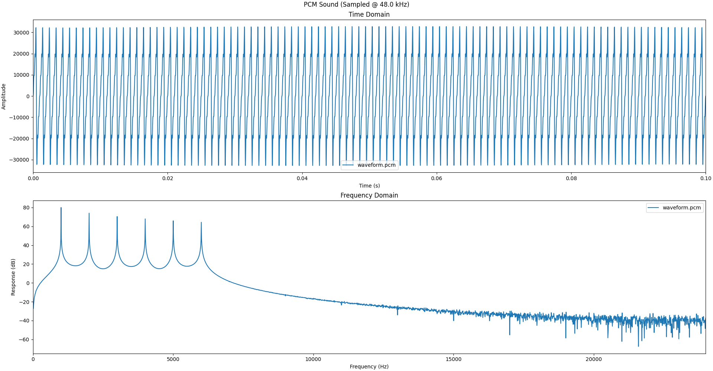
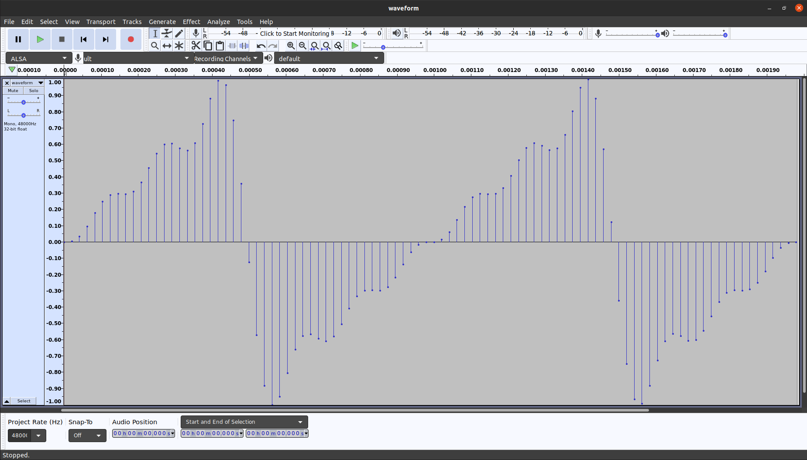
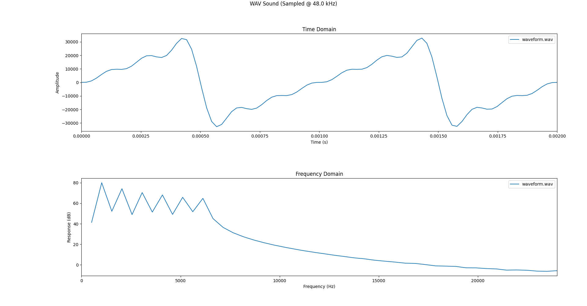
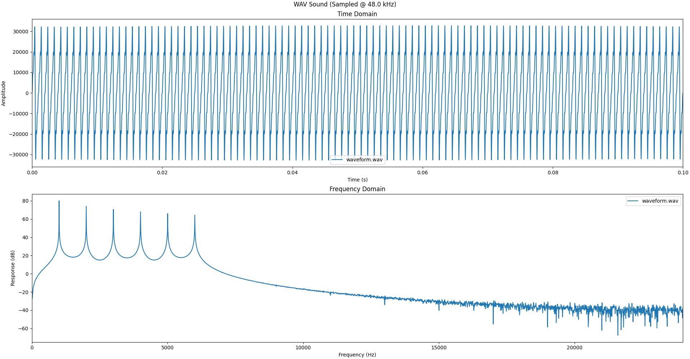
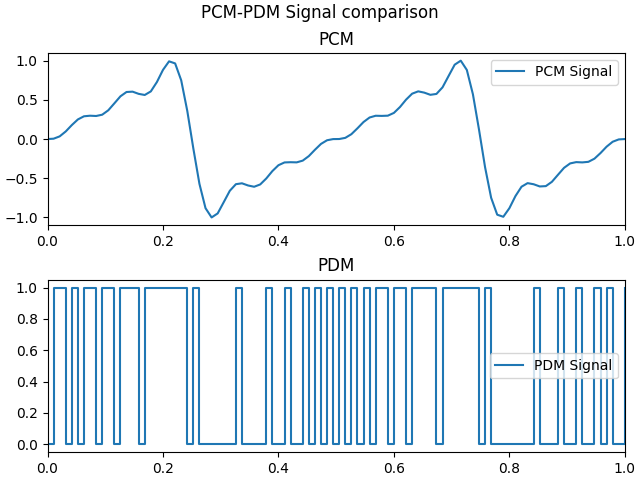
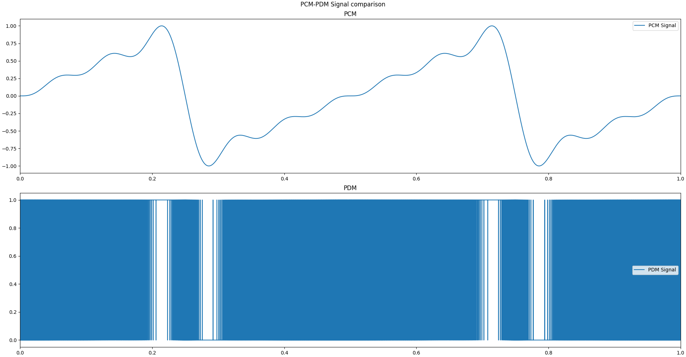

<h1>:warning: Document non relu :warning:</h1>


<h1> 01_PCM_PDM_Toolbox </h1>

Ce dossier contien un ensemble de scipt Python pour le traitement des signaux PDM, PCM et WAV. Ces scripts sont developpés pour **Python 3.8.X**


# Scripts
| Script | Objectif |
|:-------|:---------|
|[pcm_generator](pcm_generator.py)| Générer des signaux PCM à une fréquence f0 donnée à partir des coefficiant de la série de Fourier |
|[pcm2pdm](pcm2pdm.py)| Convertir des signaux PCM en PDM |
|[pcm2plot](pcm2plot.py)| Tracer les composantes temporelles et Frequencielles de signaux PCM|
|[pcm2wav](pcm2wav.py)| Convertir un signal PCM en fichier WAV|
|[wav2plot](wav2plot.py) | Tracer les composantes temporelles et Frequencielles de fichier WAV


# Installation des Modules Python nécessaires
```bash
# A partir de la racine du dépot
# Création de l'environnement Python virtuel
virtualenv venv
# Activation de l'environnement virtuel
source venv/bin/activate
# Installation des modules Python
pip install -r "requirments.txt"
# Desactivation de l'environnement virtuel
deactivate
```

Extrait de `requirments.txt`
```
cycler==0.10.0
kiwisolver==1.3.2
matplotlib==3.4.3
numpy==1.21.2
Pillow==8.3.2
pyparsing==2.4.7
pyserial==3.5
python-dateutil==2.8.2
scipy==1.7.1
six==1.16.0
```


# PCM Generator

Ce script permet de Générer un Signal PCM Echantionné à une fréquence $`fs`$ avec une fréquence fondamentalle $`f0`$ qui suit la formule suivante:

pour $`n`$ coefficiants stocké dans le tableau $`C`$

```math
x(t) =  \sum_{k=0}^{n-1} C[k] * sin(2* \pi* (k+1) * f0 * t)
```

### Message d'aide
```
usage: pcm_generator [-h] [-s SAMPLING] [-f0 F0] [-t TIME] [-c COEFFS [COEFFS ...]] <Output file>

Python Script to generate PCM waveforms

positional arguments:
  <Output file>         PCM output file

optional arguments:
  -h, --help            show this help message and exit
  -s SAMPLING, --sampling SAMPLING
                        PCM Sampling frequency
  -f0 F0                Fundamental Frequency of the signal
  -t TIME, --time TIME  Signal Duration
  -c COEFFS [COEFFS ...], --coeffs COEFFS [COEFFS ...]
                        Fourier Coefficients
```

### Exemple d'utilisation
On veut Générer un signal échantillonné à $`fs=48*10^3 Hz`$ avec une frequence fondamentalle $`f0=10^3 Hz`$ et les coefficiants de Fourier suivant: `[1 -0.5 0.333 -0.25 0.2 -0.167]` pendands 2ms.
Le script doit générer 2 periode d'un signal en dent de scie
Pour se faire on execute la commande suivante:
```bash
# A partir de la racine du dépot avec l'environnement virtuel Actif
python 01_PCM_PDM_Toolbox/pcm_generator.py "waveform.pcm" -s 48000 -f0 1000 -t 0.002 -c 1 -0.5 0.333 -0.25 0.2 -0.167
```

on retrouvera alors dans le dossier racine du dépôt un fichier `waveform.pcm` qui contient nos echantillons PCM

Le script trace la figure suivante representant les echantillons PCM en fonction du temps:


# PCM 2 Plot

Ce script permet de tracer les composantes Temporelles et Fréquencielles de plusieurs signaux PCM

### Message d'aide
```
usage: pcm2plot [-h] [-s SAMPLING] <Input file> [<Input file> ...]

Python script to Plot PCM Files

positional arguments:
  <Input file>          PCM file to convert

optional arguments:
  -h, --help            show this help message and exit
  -s SAMPLING, --sampling SAMPLING
                        Sampling Frequency

```

### Exemple d'utilisation
On veut tracer les composantes Temporelles et Fréquencielles du signal que l'on à générer dans l'exemple de [PCM Generator](#pcm_generator) afin de s'assurer que l'on a bien les 6 composante Frequencielles  a 1,2,3,4,5 et 6 kHz

On execute la commande suivante:
```bash
# A partir de la racine du dépot avec l'environnement virtuel Actif
python 01_PCM_PDM_Toolbox/pcm2plot.py -s 48000 waveform.pcm
```

On obtien alors figure suivante


Pour mieu distinguer les frequences j'ai regenerer le même signal mais sur 100ms:


# PCM 2 WAV

Ce script permet de "convertir" les sigaux PCM en fichier son WAV

### Message d'aide
```
usage: pcm2wav [-h] [-s SAMPLING] <Input file> <Output file>

Python script to convert PCM Files to WAV

positional arguments:
  <Input file>          PCM file to convert
  <Output file>         WAV output file

optional arguments:
  -h, --help            show this help message and exit
  -s SAMPLING, --sampling SAMPLING
                        Audio Sampling Frequency


```

### Exemple d'utilisation
Si on souhaite convertir le signal PCM generer dasn l'exemple [PCM Generator](#pcm_generator)

On execute la commande suivante:
```bash
# A partir de la racine du dépot avec l'environnement virtuel Actif
python 01_PCM_PDM_Toolbox/pcm2wav.py -s 48000 waveform.pcm waveform.wav
```
Quand on visualise le fichier dans Audacity on a le signal suivant:
On obtien alors figure suivante


# WAV 2 Plot

Ce script permet de tracer les composantes Temporelles et Fréquencielles de plusieurs fichier son WAV

### Message d'aide
```
usage: wav2plot [-h] <Input file> [<Input file> ...]

Python script to Plot WAV Files

positional arguments:
  <Input file>  PCM file to convert

optional arguments:
  -h, --help    show this help message and exit


```

### Exemple d'utilisation
On veut tracer les composantes Temporelles et Fréquencielles du signal que l'on à générer dans l'exemple de [PCM Generator](#pcm_generator) puis converti en fichier `WAV`dasn l'exemple de [PCM 2 WAV](#pcm_2_wav) afin de s'assurer que l'on a bien les 6 composante Frequencielles à 1,2,3,4,5 et 6 kHz

On execute la commande suivante:
```bash
# A partir de la racine du dépot avec l'environnement virtuel Actif
python 01_PCM_PDM_Toolbox/wav2plot.py waveform.wav
```

On obtien alors figure suivante


on obtien la sortie suivante en console:
```
File: waveform.wav
	Channels            : 1
	Sample Width        : 16 bits
	Sampling Frequency  : 48.0 kHz
	WAV sample count    : 96
	Duration            : 0.00 s
	Compression type    : NONE
	Compression name    : not compressed
	Size Coherent       : Yes
	Signal Minimum      : -32767
	Signal Maximum      : 32767
	Signal Average      : 0.00
	FFT Max Frequency   : 1.02 kHz
	FFT Max Value       : 80.00 dB
```


Pour mieu distinguer les frequences j'ai regenerer le même signal mais sur 100ms:


on obtien la sortie suivante en console:
```
File: waveform.wav
	Channels            : 1
	Sample Width        : 16 bits
	Sampling Frequency  : 48.0 kHz
	WAV sample count    : 4800
	Duration            : 0.10 s
	Compression type    : NONE
	Compression name    : not compressed
	Size Coherent       : Yes
	Signal Minimum      : -32767
	Signal Maximum      : 32767
	Signal Average      : 0.00
	FFT Max Frequency   : 1.00 kHz
	FFT Max Value       : 80.08 dB

```

# PCM 2 Plot

Ce script permet de convertir un signal PCM en signal PDM

(:warning: La frequence d'echantillonage du signal PDM sera la même que celle du signal PCM :warning:)

### Message d'aide
```
usage: pcm2pdm [-h] <Input file> <Output file>

Python script to convert PCM to PDM

positional arguments:
  <Input file>   PCM input file
  <Output file>  PDM output file

optional arguments:
  -h, --help     show this help message and exit
```

### Exemple d'utilisation
On veut converir en PDM le signal que l'on à générer dans l'exemple de [PCM Generator](#pcm_generator)

On execute la commande suivante:
```bash
# A partir de la racine du dépot avec l'environnement virtuel Actif
python 01_PCM_PDM_Toolbox/pcm2pdm.py waveform.pcm waveform.pdm
```

On obtien alors figure suivante


Pour permettre un traitement par le Pramme C de filtrage j'ai regéneré le signale avec une frequece d'echantionnage $`fs=3.072MHz = 48kHz*64`$:

