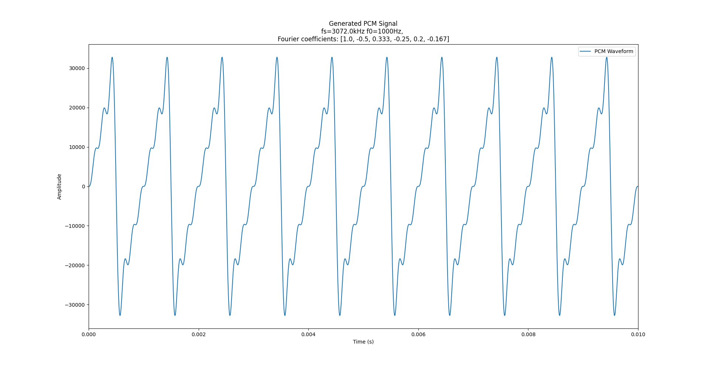
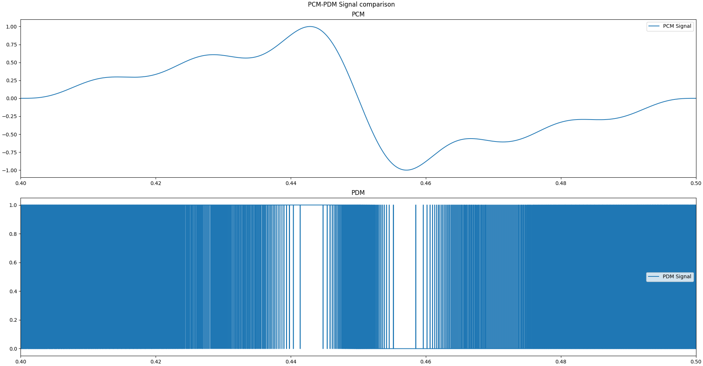
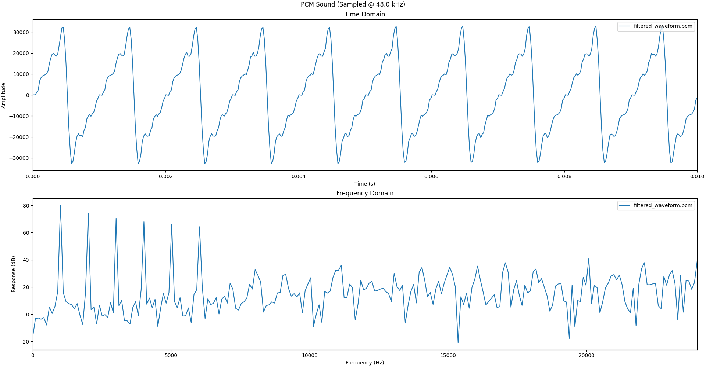
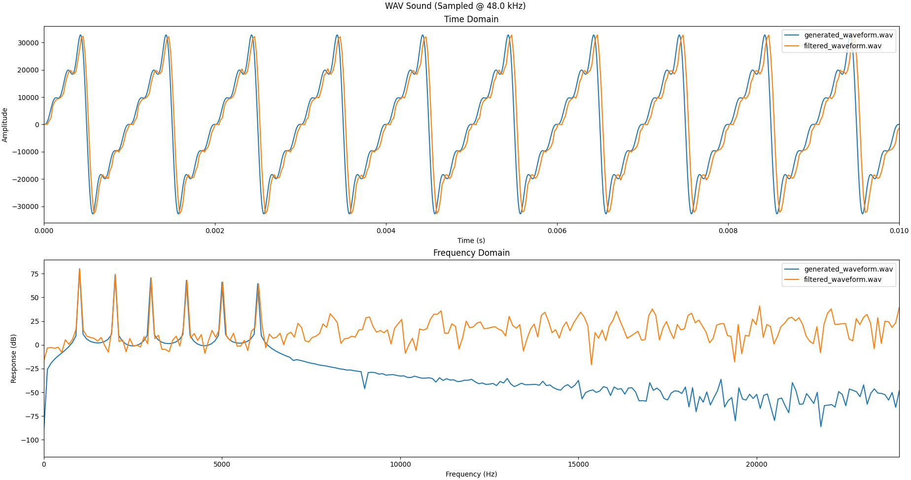
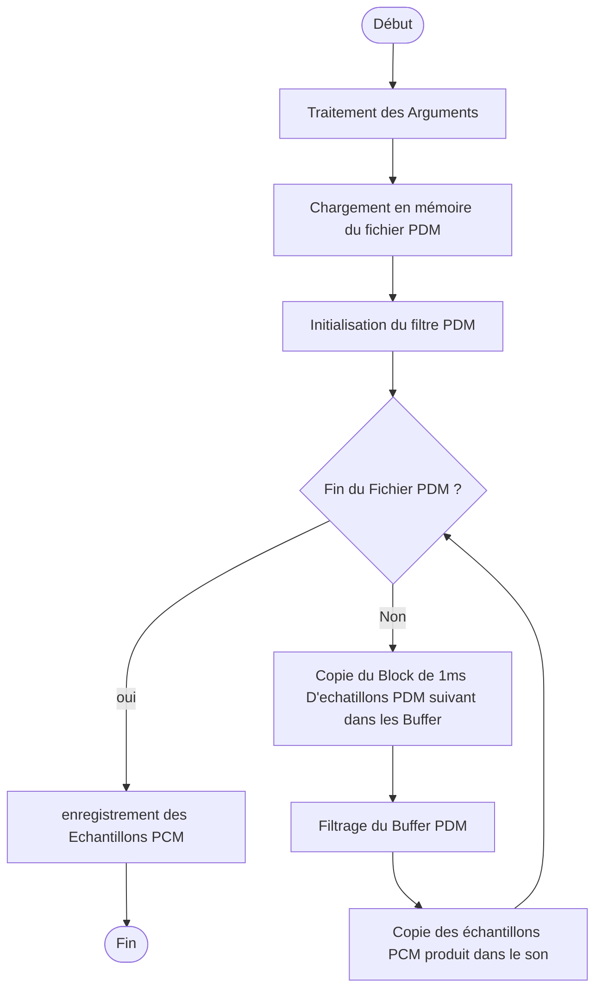

<h1> Programme C pour filtrer des signaux PDM</h1>

Ce programme Implemente le même block de filtrage que celui intégré à la carte cible pour passer des Signaux PDM aux sons PCM

# Compilation

## Pré-requis:
- CMAKE >=  3.16
- GCC >= 4.8.1

## Build

A partir de `02_Filtering/c_program`:

```bash
mkdir build && cd build
cmake ..
make -j ${nproc}
```
# Utilisation:

## Message d'aide
```
PDM Filter v0.0.1
USAGE: ./pdm_filter [-h] [-f FACTOR] <Input File> <Outpufile>
C Program to filter PDM Signals to PCM format

Positional arguments:
    <Input File>        PDM Signal file
    <Output File>       PCM output file

Optional arguments:
    -h                  Show this help message
    -f FACTOR           Decimation Factor of the filter

```

## Exemple
Dans cet Exemple nous allons:
- Générer un signal PCM echantillonné à $`fs=3.072 MHz`$
- Le convertir en PDM
- Filtrer le signal PDM ($`fs_{sortie}=48kHz`$)
- Comparer le signal original avec le signal filtrer

### Génération
Pour générer notre signal on vas utiliser le script Python [PCM Generator](../../01_PCM_PDM_Toolbox/readme.md#pcm_generator) avec les paramètres suivants:

| Option | Valeur | Commentaire |
|:------:|:-------|:------------|
| `-s`| `3072000` | $`fs = 3.072 MHz`$ |
| `-f0` | `1000` | $`f0 = 1 kHz`$|
| `-t` | `.01` | $`t = 10 ms`$|
| `-c` | `1 -0.5 0.333 -0.25 0.2 -0.167`| Coefficients de Fourier d'un signal en dent de scie a l'ordre 6

commande de génération
```bash
source venv/bin/activate
python 01_PCM_PDM_Toolbox/pcm_generator.py generated_waveform.py -s 3072000 -f0 1000 -t .01 -c 1 -0.5 0.333 -0.25 0.2 -0.167
```
Signal généré:



### Convertion en PDM
Pour convertir notre signal on vas utiliser le script Python [PCM 2 PDM](../../01_PCM_PDM_Toolbox/readme.md#pcm_2_pdm)

Commande de convertion
```bash
source venv/bin/activate
python 01_PCM_PDM_Toolbox/pcm2pdm.py generated_waveform.pcm generated_waveform.pdm
```
Signal Converti (centré sur 1 periode):



### Filtrage du signal PDM
Pour filtrer notre signal o nous allons utiliser le programme C de filtrage (une fois compilé cf. [Compilation](#compilation)) avec les paramètres suivants:

| Option | Valeur | Commentaire |
|:------:|:-------|:------------|
| `-f`| `64` | Facteur de decimation pour obtenir $`fs_{out} = \frac{fs_{in}}{decimation} = \frac{3.072*10^6}{64}=48 kHz`$ |

Commande de filtrage

```bash
02_Filtering/c_program/build/pdm_filter -f 64 generated_waveform.pdm filtered_waveform.pcm
```

Signal filtré ([PCM 2 Plot](../../01_PCM_PDM_Toolbox/readme.md#pcm_2_plot)):



### Comparaison des Signaux
Pour comparer les signaux nous allons nous appuyer sur le tracé de [WAV 2 Plot](../../01_PCM_PDM_Toolbox/readme.md#wav_2_plot) ([PCM 2 Plot](../../01_PCM_PDM_Toolbox/readme.md#pcm_2_plot) ne permettant pas de tracer des signaux avec une frequence d'echantillonnage diffrérente).

Nous allons donc commencer par convertir les deux signaux PCM en WAV en utilisant les options suivantes:


<table>
    <thead>
        <tr>
            <th>Option</th>
            <th>Valeur</th>
            <th>Commentaire</th>
        </tr>
    </thead>
    <tbody>
        <tr>
            <td colspan="3" style="text-align:center;"> generated_waveform.pcm</td>
        </tr>
        <tr>
            <td colspan="1" style="text-align:center;"><code>-s</code></td>
            <td><code>3072000</code></td>
            <td>fs=3.072MHz
        </tr>
        <tr>
            <td colspan="3" style="text-align:center;"> filtered_waveform.pcm</td>
        </tr>
        <tr>
            <td colspan="1" style="text-align:center;"><code>-s</code></td>
            <td><code>48000</code></td>
            <td>fs=48kHz
        </tr>
    </tbody>
</table>

Commandes:

```bash
source venv/bin/activate
python 01_PCM_PDM_Toolbox/pcm2wav.py -s 3072000 generated_waveform.pcm generated_waveform.wav
python 01_PCM_PDM_Toolbox/pcm2wav.py -s 48000 filtered_waveform.pcm filtered_waveform.wav

```

Pour tracer les deux sigauw nous allons utiliser la commande suivante:

```bash
source venv/bin/activate
python 01_PCM_PDM_Toolbox/wav2plot.py generated_waveform.wav filtered_waveform.wav
```



On voit que le signale filtré reproduit fidèlement le signal original avec un leger dephasage. Pour les composante frequencielles on retouve biens les 6 pic de 1 a 6 kHz dans le signal filtré.

# Documentation Doxygen

La documentation doxigen est disponible [ici](docs/html/files.html)

# Algorithme Appliqué par le programme


