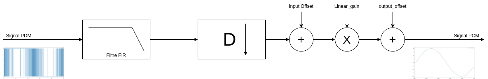
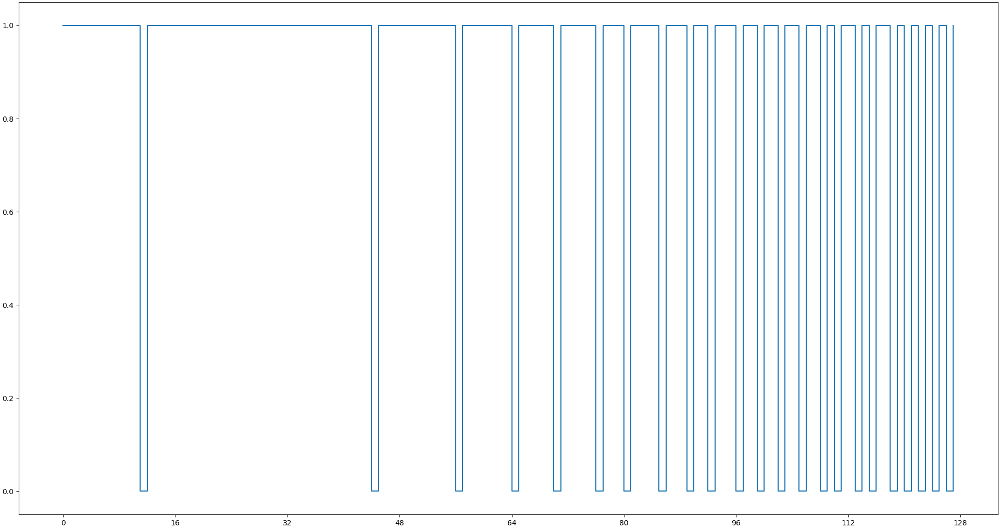
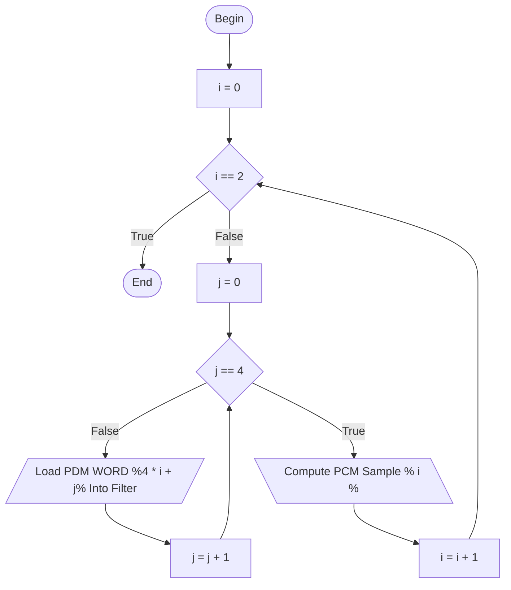
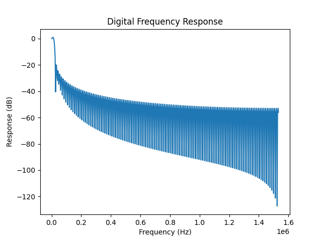

<h1> Librairie de Filtrage </h1>

# Fichiers
| Fichier | Objectif |
| :-------|:---------|
|generate_fir_filter.py| Script Python permettant de générer la Look Up Table utilisée par le filtre |
|pdm_fir/| Dossier contenant les sources du filtre |
| pdm_fir/pdm_fir.h | fichier d’entête du filtre|
|pdm_fir/pdm_fir.c | fichier de source du filtre|
|*pdm_fir/pdm_fir_.h* | Fichier généré par`generate_fir_filter.py`, il contient la Look Up Table du filtre ainsi certaines de ses constantes.


# Pipeline de filtrage
Le filtre implémenté par cette librairie applique le pipeline de filtrage suivant :




exemple:
considerons le signal PDM suivant:



On retrouve les valeurs suivante dans le Buffer PDM:

| Bit Address |  00 |  01 |  02 |  03 |  04 |  05 |  06 |  07 |  08 |  09 |  10 |  11 |  12 |  13 |  14 |  15 |PDM Word N°|
|:-----------:|:---:|:---:|:---:|:---:|:---:|:---:|:---:|:---:|:---:|:---:|:---:|:---:|:---:|:---:|:---:|:---:|:---------:|
| 000-015     |  1  |  1  |  1  |  1  |  1  |  1  |  1  |  1  |  1  |  1  |  0  |  1  |  1  |  1  |  1  |  1  | 000       |
| 016-031     |  1  |  1  |  1  |  1  |  1  |  1  |  1  |  1  |  1  |  1  |  1  |  1  |  1  |  1  |  1  |  1  | 001       |
| 032-047     |  1  |  1  |  1  |  1  |  1  |  1  |  1  |  1  |  1  |  1  |  1  |  0  |  1  |  1  |  1  |  1  | 002       |
| 048-063     |  1  |  1  |  1  |  1  |  1  |  1  |  1  |  0  |  1  |  1  |  1  |  1  |  1  |  1  |  1  |  0  | 003       |
| 064-079     |  1  |  1  |  1  |  1  |  1  |  0  |  1  |  1  |  1  |  1  |  1  |  0  |  1  |  1  |  1  |  0  | 004       |
| 080-095     |  1  |  1  |  1  |  1  |  0  |  1  |  1  |  1  |  0  |  1  |  1  |  0  |  1  |  1  |  1  |  0  | 005       |
| 096-111     |  1  |  1  |  0  |  1  |  1  |  0  |  1  |  1  |  0  |  1  |  1  |  0  |  1  |  0  |  1  |  1  | 006       |
| 112-127     |  0  |  1  |  0  |  1  |  1  |  0  |  1  |  0  |  1  |  0  |  1  |  0  |  1  |  0  |  1  |  0  | 007       |

Si on applique le filtre sur ces données (128 echantillons PDM) avec un facteur de décimation de 64 (On calcul 1 échantillons PCM pour 64 PDM):


Ce qui nous donne les échantillons PCM suivants une fois l'algorithme appliqué:
| PCM Sample N° | Value |
|:-------------:|:-----:|
|             0 | 29503 |
|             1 | 15713 |


# Générer un filtre


Ce script `generate_fir_filter` nous permet de générer la Look Up Table utilisée par la bibliothèque de filtrage. Pour ce faire le script a besoin de plusieurs valeurs :

|Paramètre|Valeur Recommander | Effet|
|:-|:-|:-|
| taps | 16 | Cette valeur correspond à l’ordre du filtre numérique|
| Sampling Frequency | Pour un facteur de décimation de $`D`$ : $`fs_{PDM} = D * fs_{PCM}`$ | Cette valeur correspond à la fréquence d’échantillonnage ($`fs_{PDM}`$) du signal PDM |
| Cutoff Frequency | $`\leq \frac{fs_{PCM}}{2}`$ | Fréquence de Coupure du filtre, cette fréquence doit être inférieure ou égale à $`\frac{fs_{PCM}}{2}`$ pour respecter la condition de Shannon |
| Scale Bits | 30 | Cette valeur règle le nombre de bits maximum utilisés par un échantillon PCM.

Message d’aide du script :
```
usage : generate_pdm_fir.py [-h] -t <n_taps> -s <sampling_frequency> -c <cutoff_frequency> -b <scale_bits> [-p]

Python script to generate PDM Taps for the PDM FIR library

optional arguments:
  -h, --help            show this help message and exit
  -t <n_taps>, --taps <n_taps>
                        number of taps used by the filter
  -s <sampling_frequency>, --sampling <sampling_frequency>
                        Sampling frequency of the Signal to Filter
  -c <cutoff_frequency>, --cutoff <cutoff_frequency>
                        Cutoff frequency of the filter (up to target PCM frequency / 2)
  -b <scale_bits>, --bits <scale_bits>
                        Maximum number of bits used in the filter output
  -p, --plot            Plot filter characteristics

```

## Exemple de génération

Avant de générer la Look Up Table d’un filtre PDM, on va répondre 2 questions :
 1. À quelle fréquence veut-on échantillonner le signal PCM ?

On cherche à produire un signal PCM échantillonné à $`48 kHz`$ ce qui nous donne une fréquence de coupure maximale de $`24 kHz`$ afin de se donner de la marge on va utilisé une fréquence de coupure a $`20 kHz`$, cette limitation dans la bande passante n’est pas un problème, car la fréquence maximum qui peut être perçue par l’oreille humaine est au voisinage de $`20 kHz`$  

 2. À quelle fréquence est échantillonné notre signal PDM ?

Dans cet exemple, voulons un signal PCM à $`48 kHz`$, qui sera issu du filtre avec un facteur de décimation $`D`$ de 64. Le signal PDM sera donc échantillonné à $`3.072 MHz`$ ($`fs_{PDM}= D * fs_{PCM} = 64 * 48 * 10^{3} = 3.072 * 10^{6}`$).


Nous allons donc utiliser les paramètres suivants :

 - taps : 16
 - sampling_frequency : 3072000
 - cutoff : 20000
 - bit_scale : 30

 Ce qui donne la commande de génération suivante

```bash
# Depuis de dossier racine du dépôt
# cf. 01_PCM_PDM_Toolbox pour l’installation de l’environnement virtuel
source venv/bin/activate
python 02_Filtering/filter_library/generate_fir_filter.py -t 16 -s 3072000 -c 20000 -b 30 -p
```

l’option `-p` trace la courbe de réponse en fréquence du filtre dans notre cas elle est la suivante :



On retrouve en console la sortie suivante :

```
Generating PDM Filter LUT:
 PDM fs = 3072.0 kHz
 Signal fs = 20.0 kHz
 Cut Off Window: 0.2 kHz
Generating PDM Filter Static coefficients into ~/git/stm32pdm/02_Filtering/filter_library/pdm_fir/pdm_fir_.h
Generation Finished, you can now copy the folder "~/git/stm32pdm/02_Filtering/filter_library/pdm_fir" into your C project
```


## Exemple de pdm_fir/pdm_fir_.h
```c
#ifndef PDM_FIR__H
#define PDM_FIR__H
/**
 * @file pdm_fir_.h
 * @brief File containing Generated LUT of the FIR filter
 * @date Generation: 03-11-2021 15:13:05
 */
/*
 +--------------------------------------------------+
 |                                                  |
 |         Generated by generate_pdm_fir.py         |
 |               03-11-2021 15:13:05                |
 |                                                  |
 +--------------------------------------------------+
*/

#define PDM_FTL_SCALE_BITS  30
#define PDM_FTL_TAPS        16

static const int byte_coeff[PDM_FTL_TAPS*2][256] = {
 { // [0]
   0x0146fa4c,  0x00eee730,  0x00f07ce4,  0x009869c8,  0x00f230b8,  0x009a1d9c,  0x009bb350,  0x0043a034,
   0x00f40180,  0x009bee64,  0x009d8418,  0x004570fc,  0x009f37ec,  0x004724d0,  0x0048ba84, -0x000f5898,
   0x00f5ee12,  0x009ddaf6,  0x009f70aa,  0x00475d8e,  0x00a1247e,  0x00491162,  0x004aa716, -0x000d6c06,
   0x00a2f546,  0x004ae22a,  0x004c77de, -0x000b9b3e,  0x004e2bb2, -0x0009e76a, -0x000851b6, -0x006064d2,
   0x00f7f53c,  0x009fe220,  0x00a177d4,  0x004964b8,  0x00a32ba8,  0x004b188c,  0x004cae40, -0x000b64dc,
   0x00a4fc70,  0x004ce954,  0x004e7f08, -0x00099414,  0x005032dc, -0x0007e040, -0x00064a8c, -0x005e5da8,
   0x00a6e902,  0x004ed5e6,  0x00506b9a, -0x0007a782,  0x00521f6e, -0x0005f3ae, -0x00045dfa, -0x005c7116,
   0x0053f036, -0x000422e6, -0x00028d32, -0x005aa04e, -0x0000d95e, -0x0058ec7a, -0x005756c6, -0x00af69e2,
   0x00fa15c2,  0x00a202a6,  0x00a3985a,  0x004b853e,  0x00a54c2e,  0x004d3912,  0x004ecec6, -0x00094456,
   0x00a71cf6,  0x004f09da,  0x00509f8e, -0x0007738e,  0x00525362, -0x0005bfba, -0x00042a06, -0x005c3d22,
   0x00a90988,  0x0050f66c,  0x00528c20, -0x000586fc,  0x00543ff4, -0x0003d328, -0x00023d74, -0x005a5090,
   0x005610bc, -0x00020260, -0x00006cac, -0x00587fc8,  0x00014728, -0x0056cbf4, -0x00553640, -0x00ad495c,
   0x00ab10b2,  0x0052fd96,  0x0054934a, -0x00037fd2,  0x0056471e, -0x0001cbfe, -0x0000364a, -0x00584966,
   0x005817e6,  0x000004ca,  0x00019a7e, -0x0056789e,  0x00034e52, -0x0054c4ca, -0x00532f16, -0x00ab4232,
   0x005a0478,  0x0001f15c,  0x00038710, -0x00548c0c,  0x00053ae4, -0x0052d838, -0x00514284, -0x00a955a0,
   0x00070bac, -0x00510770, -0x004f71bc, -0x00a784d8, -0x004dbde8, -0x00a5d104, -0x00a43b50, -0x00fc4e6c,
   0x00fc4e6c,  0x00a43b50,  0x00a5d104,  0x004dbde8,  0x00a784d8,  0x004f71bc,  0x00510770, -0x00070bac,
   0x00a955a0,  0x00514284,  0x0052d838, -0x00053ae4,  0x00548c0c, -0x00038710, -0x0001f15c, -0x005a0478,
   0x00ab4232,  0x00532f16,  0x0054c4ca, -0x00034e52,  0x0056789e, -0x00019a7e, -0x000004ca, -0x005817e6,
   0x00584966,  0x0000364a,  0x0001cbfe, -0x0056471e,  0x00037fd2, -0x0054934a, -0x0052fd96, -0x00ab10b2,
   0x00ad495c,  0x00553640,  0x0056cbf4, -0x00014728,  0x00587fc8,  0x00006cac,  0x00020260, -0x005610bc,
   0x005a5090,  0x00023d74,  0x0003d328, -0x00543ff4,  0x000586fc, -0x00528c20, -0x0050f66c, -0x00a90988,
   0x005c3d22,  0x00042a06,  0x0005bfba, -0x00525362,  0x0007738e, -0x00509f8e, -0x004f09da, -0x00a71cf6,
   0x00094456, -0x004ecec6, -0x004d3912, -0x00a54c2e, -0x004b853e, -0x00a3985a, -0x00a202a6, -0x00fa15c2,
   0x00af69e2,  0x005756c6,  0x0058ec7a,  0x0000d95e,  0x005aa04e,  0x00028d32,  0x000422e6, -0x0053f036,
   0x005c7116,  0x00045dfa,  0x0005f3ae, -0x00521f6e,  0x0007a782, -0x00506b9a, -0x004ed5e6, -0x00a6e902,
   0x005e5da8,  0x00064a8c,  0x0007e040, -0x005032dc,  0x00099414, -0x004e7f08, -0x004ce954, -0x00a4fc70,
   0x000b64dc, -0x004cae40, -0x004b188c, -0x00a32ba8, -0x004964b8, -0x00a177d4, -0x009fe220, -0x00f7f53c,
   0x006064d2,  0x000851b6,  0x0009e76a, -0x004e2bb2,  0x000b9b3e, -0x004c77de, -0x004ae22a, -0x00a2f546,
   0x000d6c06, -0x004aa716, -0x00491162, -0x00a1247e, -0x00475d8e, -0x009f70aa, -0x009ddaf6, -0x00f5ee12,
   0x000f5898, -0x0048ba84, -0x004724d0, -0x009f37ec, -0x004570fc, -0x009d8418, -0x009bee64, -0x00f40180,
  -0x0043a034, -0x009bb350, -0x009a1d9c, -0x00f230b8, -0x009869c8, -0x00f07ce4, -0x00eee730, -0x0146fa4c
 },

    ...

 { // [31]
        ...
 }
};
#endif // PDM_FIR__H

```

# Intégrer la Librairie
## Cmake

### PC

L’intégration de la bibliothèque dans un Projet CMAKE "*classique*" se fait en plusieurs étapes :
 1. Copier la librairie une fois la LUT généré (cf. [générer un filtre](#générer-un-filtre)) dans le dossier contenant les librairies
 2. Dans le fichier, `CMakeLists.txt` ajoutez à l’instruction `include_directories` le dossier contenant la librairie.
 3. Dans le fichier, `CMakeLists.txt` ajoutez à l’instruction `add_executable` le fichier `pdm_fir.c`

exemple :
Pour un projet CMake avec l’arborescence suivante :
```
 /
 |_inc/
 |   |_main.h
 |_lib/
 |    |_pdm_fir/
 |        |_pdm_fir.h
 |        |_pdm_fir_.h
 |        |_pdm_fir.c
 |_src/
 |    |_main.c
 |_CMakeLists.txt
```

On retrouvera le fichier `CMakeLists.txt` suivant une fois la librairie intégrée :
```cmake
cmake_minimum_required(VERSION 3.16)
project(pdm_filter LANGUAGES C)


set(CMAKE_C_STANDARD 11)

include_directories(inc/ lib/pdm_fir)

add_executable(pdm_filter lib/pdm_fir/pdm_fir.c src/main.c)

```

### STM32 (projet [Clion](https://www.jetbrains.com/fr-fr/clion/))

L’intégration de la librairie à un projet Clion pour STM32CubeMX (cf. [STM32CubeMX projects](https://www.jetbrains.com/help/clion/embedded-development.html)) est un peu plus complexe, car le fichier `CMakeLists.txt` est généré automatiquement par Clion à chaque génération du code par CubeMX. Il faut donc opérer nos modifications dans un fichier nommé`CMakeLists_template.txt`. Dans ce cas, il faut suivre les étapes suivantes :
 1. Copier la librairie une fois la LUT généré (cf. [générer un filtre](#générer-un-filtre)) à la racine du projet

 2. Dans le fichier, `CMakeLists_template.txt` modifiez l’instruction : `include_directories(${includes})` de la manière suivante : `include_directories(${includes} pdm_fir)`

 3. Dans le fichier, `CMakeLists_template.txt` modifiez l’instruction : `file(GLOB_RECURSE SOURCES ${sources})` de la manière suivante : `file(GLOB_RECURSE SOURCES ${sources} "pdm_fir/*.*")`
 3. Régénérez les sources à partir de CubeMX (afin de rafraichir le projet dans Clion et donc de régénérer le`CMakeLists.txt`)


## Makefile STM32

L’intégration de la librairie a un projet Makefile STM32 généré par CubeMX :
 1. Copier la librairie une fois la LUT généré (cf. [Générer un filtre](#générer-un-filtre)) à la racine du projet
 2. Dans le fichier `Makefile` section : `CFLAGS` ajouter à la variable `C_INCLUDES` une ligne :`-Ipdm_fir/`. (ajouter un `\` à la fin de la ligne précédente)
 3. Dans le fichier `Makefile` section : `source` ajouter à la variable `C_SOURCES` une ligne : `pdm_fir/pdm_fir.c`. (ajouter un `\` à la fin de la ligne précédente)


# Structures de Données
## pdm_fir_filter_t

```c
typedef struct {
    uint16_t    buffer[PDM_FTL_TAPS];
    size_t      next_tap;
} pdm_fir_filter_t;
```
| Variable | Type | Rôles |
|:---------|:-----|:------|
| `buffer` | `uitn16[PDM_FTL_TAPS]` | Tableau `PDM_FTL_TAPS` entier non signé sur 16 bit $`\in [0; 65535]`$. Ce tableau sert de mémoire tampon au filtre FIR.|
|`next_tap`| `size_t` | Cette variable indique l’emplacement dans le tableau `buffer` de l’échantillon suivant|


## pdm_fir_filter_config_t
```c
typedef struct {
    pdm_fir_filter_t*   fir_filter;
    uint16_t            decimation_factor;
    int16_t             input_offset;
    int16_t             output_offset;
    uint16_t            linear_gain;
    uint8_t             bit_scale;
} pdm_fir_filter_config_t;
```

| Variable | Type | Rôles |
|:---------|:-----|:------|
| `fir_fiter` | `pdm_fir_filter_t*` | pointeur vers une structure [pdm_fir_filter_t](#pdm_fir_filter_t)|
|`decimation_factor`| `uint16_t` | Entier non signé sur 16 bits représentant le facteur de décimation $`D`$ du filtre FIR ($`fs_{PCM} = \frac{fs_{PDM}}{D}`$). Dans l’implémentation du filtre, ce facteur doit être un multiple de 16 avec une valeur minimale de 16.|
|`input_offset`| `int16_t`| Entier signé sur 16 bits représentant l’offset à appliquer avant l’amplification du signal PCM (cf. [Pipeline de filtrage](#pipeline-de-filtrage))|
|`output_offset`| `int16_t`| Entier signé sur 16 bits représentant l’offset à appliquer après l’amplification du signal PCM (cf. [Pipeline de filtrage](#pipeline-de-filtrage))|
|`linear_gain`| `uint16_t`| Entier non signé sur 16 bits représentant le facteur amplification linéaire appliqué au signal PCM (cf. [Pipeline de filtrage](#pipeline-de-filtrage))|
|`bit_scale`| `uint8_t` | Entier non signé sur 8 bits représentant le nombre de bits utilisé par les échantillons PCM (:warning: Doit être inférieur au `bit_scale` défini à la génération : warning:)


# Fonctions

## pdm_fir_flt_init

prototype :
```c
void pdm_fir_flt_init(pdm_fit_filter_t *f);
```


| Paramètre | Type | Commentaire |
|:---------:|:----:|:------------|
| `f` | `pdm_fir_filter_t*` | Structure contenant les données du filtre|

Cette Fonction initialise la structure de données utilisée par le filtre PDM

## pdm_fir_flt_config_init

prototype :
```c
void pdm_fir_flt_config_init(pdm_fir_filter_config_t *f, uint16_t decimation_factor, int16_t input_offset, int16_t output_offset, uint16_t linear_gain, uint8_t bit_scale);

```


| Paramètre | Type | Commentaire |
|:---------:|:----:|:------------|
| `f` | `pdm_fir_filter_config_t*` | Structure contenant les données du filtre ainsi que sa configuration|
| `decimation_factor` | `uint16_t` | Facteur de décimation du filtre|*
| `input_offset` | `int16_t` | Offset à appliquer sur les échantillons PCM AVANT leur amplification |
| `output_offset` | `int16_t` | Offset à appliquer sur les échantillons PCM APRÈS leur amplification
| `linear_gain` | `uint16_t` | Gain linéaire à appliquer sur le signal PCM |
| `bit_scale` | `uint8_t` | Tailles des échantillons PCM en bits (Doit être inférieur au `bit_scale` défini à la génération)

Cette Fonction initialise le filtre PDM et sa configuration

## pdm_fir_flt_config_deInit

prototype :
```c
void pdm_fir_flt_config_deInit(pdm_fir_filter_config_t *f);

```


| Paramètre | Type | Commentaire |
|:---------:|:----:|:------------|
| `f` | `pdm_fir_filter_config_t*` | Structure contenant les données du filtre ainsi que sa configuration|

Cette Fonction désalloue les données allouées dynamiquement par la fonction [pdm_fir_flt_config_init](#pdm_fir_flt_config_init)

## pdm_fir_flt_put

prototype :
```c
void pdm_fir_flt_put(pdm_fir_filter_t *f, uint16_t bits);

```


| Paramètre | Type | Commentaire |
|:---------:|:----:|:------------|
| `f`       | `pdm_fir_filter_t*` | Structure contenant les données du filtre |
| `bits`    | `uint16_t` | Tailles des échantillons PCM en bits (doit être inférieur au `bit_scale` défini à la génération) |

Cette Fonction ajoute un mot PDM de 16 bit au filtre

## pdm_fir_flt_get

prototype :
```c
void pdm_fir_flt_get(pdm_fir_filter_t *f, int out_bits);

```


| Paramètre | Type | Commentaire |
|:---------:|:----:|:------------|
| `f`       | `pdm_fir_filter_t*` | Structure contenant les données du filtre |
| `out_bits`    | `int` | Mot PDM (16 échantillons, MSB en premier) |

Cette Fonction extrait un échantillon PCM du filtre dont la valeur appartient à $`[-2^{out\_bits-1}; 2^{out\_bits -1}-1 ]`$ cependant dans certain cas, la valeur doit être tronquée pour éviter d’éventuel inversement de signe aux valeurs minimales et maximales d’un échantillon PCM

## pdm_fir_flt_chunk

prototype :
```c
uint32_t pdm_fir_flt_chunk(pdm_fir_filter_config_t *f, uint16_t *pcm_output, const uint16_t *pdm_input, uint32_t pdm_size);

```


| Paramètre | Type | Commentaire |
|:---------:|:----:|:------------|
| `f`       | `pdm_fir_filter_config_t*` | Structure contenant les données du filtre ainsi que sa configuration |
| `pcm_output`| `uint16_t*` | Buffer de sortie des échantillons PCM |
| `pdm_input` | `const uint16_t*` | Buffer d’entrée des échantillons PDM |
| `pdm_size` | `uint32_t` | Nombre de mots de 16 échantillons PDM à filtrer

Retour :

|Type | Commentaire |
|:---:|:-----------|
| `uint32_t` |  Nombre d’échantillons PCM filtré |

Cette Fonction filtre le buffer PDM grâce à l’algorithme suivant :


```
FONCTION pdm_fir_ftl_chunk(f, pcm_output, pdm_input, pdm_size)
    decimation_word = f->decimation_factor / 16
    pcm_to_write = pdm_size/decimation_word
    POUR i DE 0 A pcm_to_write AVEC UN PAS DE 1
        POUR j DE 0 A 16 AVEC UN PAS DE 1
            pdm_fir_flt_put(f->fir_filter, pdm_input[i * decimation_word + j])
        FIN POUR
        pcm_sample = pdm_fir_flt_get(f->fir_filter, f->bit_scale)
        pcm_sample = ((pcm_sample + f->input_offset) * f->linear_gain) + f->output_offset
        SI pcm_sample SUPÉRIEUR STRICT A (2^f->bit_scale) - 1
            pcm_sample = (2^f->bit_scale) - 1
        FIN SI
        SI pcm_sample INFÉRIEUR STRICT A -((2^f->bit_scale) - 1)
            pcm_sample = -((2^f->bit_scale) - 1)
        FIN SI
        pcm_buffer[i] = pcm_sample
    FIN POUR
    RETOURNER pcm_to_write
FIN FONCTION
```
