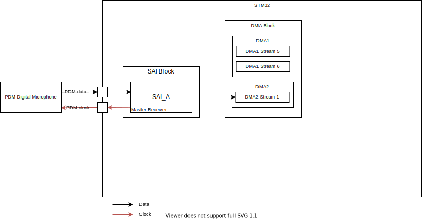
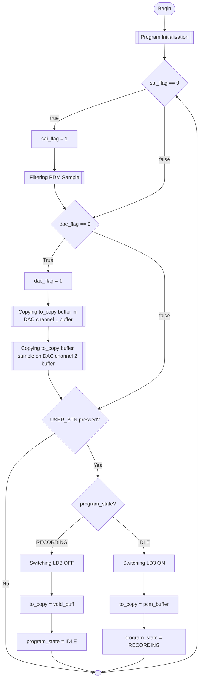

<h1> Direct Output </h1>

Ce Programme quand il est dans l'état `RECORDING` capte les sons ambiants via un microphone PDM, traite le le signal et joue sur les deux cannaux du DAC les son capté en temps réel

<figure>
    
<figcaption style="text-align:center"><em>Peripherals Bock Diagram</em></figcaption>
</figure>

Ce Programme implemente la mache de 2 états suivante


La transition d'un état à l'autre se fait par un appui sur le bouton `USER` (bouton bleu sur la carte)


## Algoritme du Programme

Les Flags `dac_flag` et `sai_flag` sont mis a `0` par les fonctions executier quand le `DMA` atteind la moitier ou la fin d'un du buffer correspondant ( sai : `pdm_buffer`, dac : `dac_buffer_l`)





Code de la machine d'états:

```c
uint32_t idle_counter = 0;
    uint32_t cool_down = 0;
    const uint16_t *to_copy = void_buff;
    HAL_GPIO_WritePin(GPIOG, LD4_Pin, GPIO_PIN_SET); // Ready LED
    while (1) {
        if(!sai_flag == 0){
            (void) pdm_fir_fif_ftl_chunk(&pdm_filter, pcm_buffer, pdm_buffer + sai_half * PDM_BUFFER_SIZE, PDM_BUFFER_SIZE);
            if(cool_down > 0) cool_down--;
            sai_flag=1;
        }
        if(dac_flag == 0){
            memcpy(dac_buffer_l + dac_half * PCM_BUFFER_SIZE, to_copy, sizeof(uitn16_t) * PCM_BUFFER_SIZE);
            memcpy(dac_buffer_r + dac_half * PCM_BUFFER_SIZE, to_copy, sizeof(uitn16_t) * PCM_BUFFER_SIZE);
        }

        switch (current_state) {
            case IDLE:
                if(HAL_GPIO_ReadPin(GPIOA, USER_BTN_Pin) == GPIO_PIN_SET && cool_down == 0){
                    current_state = RECORDING;
                    cool_down = 500;
                    HAL_GPIO_WritePin(GPIOG, LD3_Pin, GPIO_PIN_SET);
                    to_copy = pcm_buffer;
                }
                break;
            case RECORDING:
                if(HAL_GPIO_ReadPin(GPIOA, USER_BTN_Pin) == GPIO_PIN_SET && cool_down == 0){
                    current_state = IDLE;
                    cool_down = 500;
                    HAL_GPIO_WritePin(GPIOG, LD3_Pin, GPIO_PIN_RESET);
                    to_copy = void_buff;
                }
                break;

        }

    }


```
