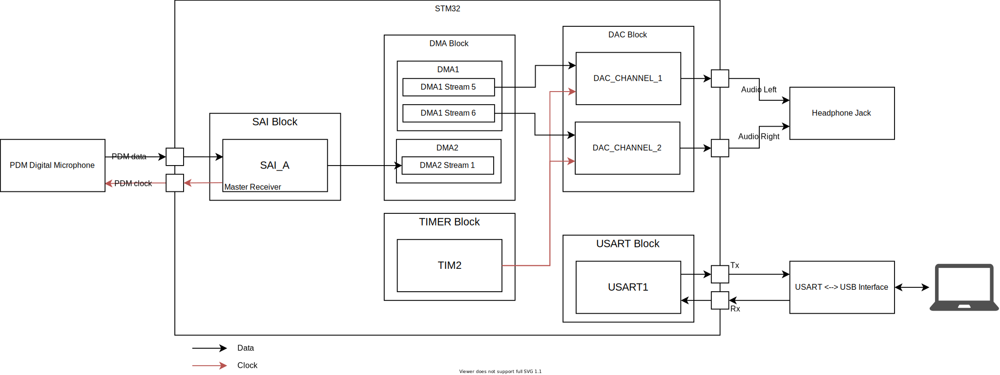
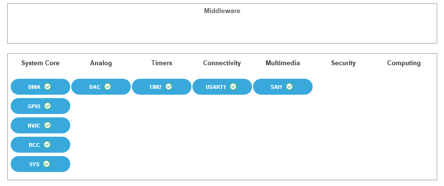
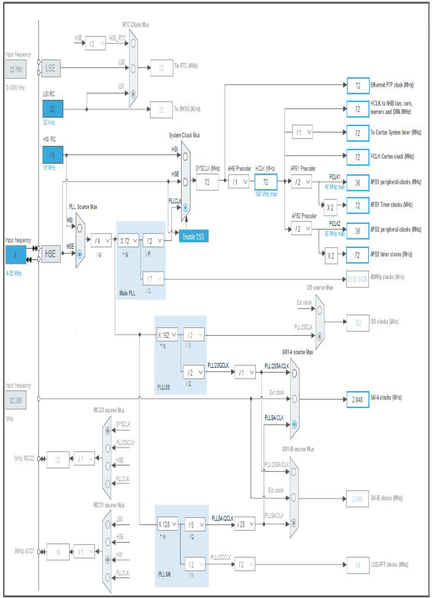
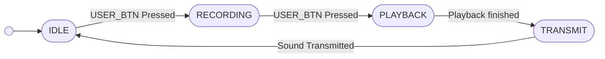
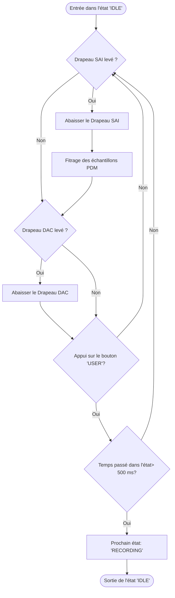
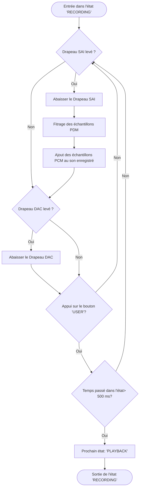
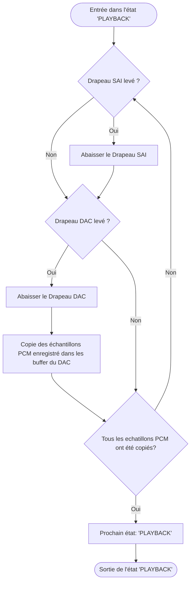
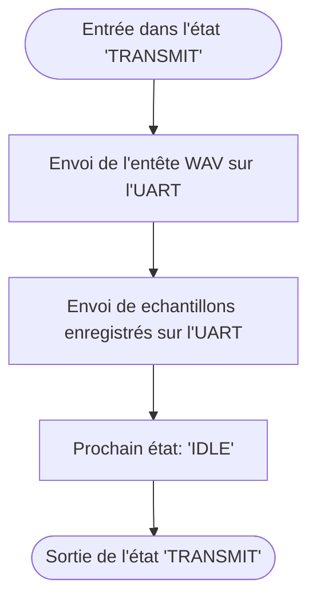

<h1> Parrot </h1>

Digital Recorder est un démonstrateur dont l’objectif est d’enregistrer les sons ambiants lors de l'appui sur un bouton, puis le rejeux de ceux-ci sur le DAC lors d'un second appui


# Schéma Block des Péripheriques
<figure>
    
<figcaption style="text-align:center"><em>Peripherals Bock Diagram</em></figcaption>
</figure>

# Pinout

<table>
 <thead>
  <tr>
   <th>PIN</th>
   <th>Signal</th>
   <th>Commentaire</th>
   <th>Périphérique</th>
  <tr>
 </thead>
 <tbody>
  <tr>
   <td>PA0</td>
   <td>USER_BUTTON</td>
   <td>Bouton Bleu de la carte</td>
   <td style="text-align: center; vertical-align: middle;" rowspan="3">GPIO</td>
  </tr>
  <tr>
   <td>PG13</td>
   <td>LD3</td>
   <td>LED Verte</td>
  </tr>
  <tr>
   <td>PG14</td>
   <td>LD4</td>
   <td>LED Rouge</td>
  <tr>
  <tr>
  <td>PH0</td>
   <td>RCC_OSC_IN</td>
   <td style="vertical-align: middle;" rowspan="2">Signaux de l’oscillateur</td>
   <td style="text-align: center; vertical-align: middle;" rowspan="2">RCC</td>
  </tr>
  <tr>
   <td>PH1</td>
   <td>RCC_OSC_OUT</td>
  </tr>
  <tr>
   <td>PE4</td>
   <td>SAI_FS_A</td>
<td>SAI SELECT</td>
<td style="text-align: center; vertical-align: middle;" rowspan="3">SAI 1</td>
  </tr>
  <tr>
   <td>PE5</td>
   <td>SAI_SCK_A</td>
<td>SAI CLOCK</td>
  </tr>
  <tr>
   <td>PE6</td>
<td>SAI_SD_A</td>
<td>SAI DATA</td>
  </tr>
  <tr>
   <td>PA13</td>
<td>SYS_JTMS-SWDIO</td>
   <td style="vertical-align: middle;" rowspan="2">Lignes de DEBUG</td>
   <td style="text-align: center; vertical-align: middle;" rowspan="2">SYS</td>
  </tr>
  <tr>
   <td>PA14</td>
<td>SYS_JTCK-SWCLK</td>
  </tr>
  <tr>
       <td>PA9</td>
       <td>USART1_TX</td>
       <td>Canal TX de l’USART 1</td>
       <td style="text-align: center; vertical-align: middle;" rowspan="2">USART 1</td>
  </tr>
  <tr>
       <td>PA9</td>
       <td>USART1_RX</td>
       <td>Canal RX de l’USART 1</td>
  </tr>
  <tr>
        <td>PA5</td>
        <td>DAC_OUT2</td>
        <td>Sortie du Canal 2 du DAC</td>
        <td style="text-align: center; vertical-align: middle;" rowspan="2">DAC</td>
  </tr>
  <tr>
        <td>PA4</td>
        <td>DAC_OUT1</td>
        <td>Sortie du Canal 1 du DAC</td>
  </tr>
 </tbody>
</table>

# Vue Système

<figure>
    
<figcaption style="text-align:center"><em>System View</em></figcaption>
</figure>

# Horloges

<figure>
    
<figcaption style="text-align:center"><em>Clocks</em></figcaption>
</figure>

### Horloges importantes

#### Schéma des horloges importantes

 ```mermaid
 graph LR
     INPUT(("Input Frequency"))
     HCLK(("HCLK"))
     48M_CLK(("48 MHz Clock"))
     SAI_A_CLK(("SAI-A Clock"))
     DIVIDE_M["/M"]
     MPLL_MULTIPLY_N[*N]
     MPLL_DIVIDE_P["/P"]
     MPLL_DIVIDE_Q["/Q"]
     AHB_PRESCALER["/AHB_Prescaler"]
     PLL_SAIQCLK["/PLL_SAIQCLK"]
     SPLL_MULTIPLY_N["*N"]
     SPLL_DIVIDE_Q["/Q"]


     subgraph Main PLL
         MPLL_MULTIPLY_N --> MPLL_DIVIDE_P;
         MPLL_MULTIPLY_N --> MPLL_DIVIDE_Q;
     end;

     subgraph PLL SAI
        SPLL_MULTIPLY_N --> SPLL_DIVIDE_Q;
     end

     INPUT --> DIVIDE_M;
     DIVIDE_M --> MPLL_MULTIPLY_N;
     DIVIDE_M -->SPLL_MULTIPLY_N
     MPLL_DIVIDE_P --> AHB_PRESCALER;
     MPLL_DIVIDE_Q ---> 48M_CLK
     AHB_PRESCALER -->HCLK;

     SPLL_DIVIDE_Q --> PLL_SAIQCLK;
     PLL_SAIQCLK-->SAI_A_CLK;
 ```

 #### Configuration des horloges

 - HCLK

<table>
    <thead>
        <tr>
            <th>Variable</th><th>Bloc</th><th>Valeur</th><th>Opération</th>
        </tr>
    </thead>
    <tbody>
        <tr>
            <td>M</td><td>N/A</td><td>4</td><td>Division</td>
        </tr>
        <tr>
            <td>N</td><td>Main PLL</td><td>72</td><td>Multiplication</td>
        </tr>
        <tr>
            <td>P</td><td>Main PLL</td><td>2</td><td>Division</td>
        </tr>
        <tr>
            <td>AHB_PRESCALER</td><td>N/A</td><td>1</td><td>Division</td>
        </tr>
    </tbdoy>
</table>


 ```math
HCLK = \frac{\frac{\frac{Input Frequency}{M} * N}{P}}{AHB Prescaler} = \frac{\frac{\frac{8}{4} * 72}{2}}{1} *10^6 =  72*10^6 Hz
 ```

 - SAI-A Clock
 <table>
     <thead>
         <tr>
             <th>Variable</th><th>Bloc</th><th>Valeur</th><th>Opération</th>
         </tr>
     </thead>
     <tbody>
         <tr>
             <td>M</td><td>N/A</td><td>4</td><td>Division</td>
         </tr>
         <tr>
             <td>N</td><td>PLL SAI</td><td>128</td><td>Multiplication</td>
         </tr>
         <tr>
             <td>P</td><td>PLL SAI</td><td>5</td><td>Division</td>
         </tr>
         <tr>
             <td>PLL_SAIQCLK</td><td>N/A</td><td>25</td><td>Division</td>
         </tr>
     </tbdoy>
 </table>

```math
SAI A Clock = \frac{\frac{\frac{Input Frequency}{M} * N}{Q}}{PLL SAIQCLK} = \frac{\frac{\frac{8}{4} * 128}{5}}{25} *10^6 = 2.048 *10^6Hz
```

#### Valeurs des Horloges

 ```mermaid
 graph LR
 INPUT(("Input Frequency"))
 HCLK(("HCLK"))
 SAI_A_CLK(("SAI-A Clock"))
     DIVIDE_M["/4"]
     MPLL_MULTIPLY_N[*72]
     MPLL_DIVIDE_P["/2"]
     AHB_PRESCALER["/1"]
     PLL_SAIQCLK["/25"]
     SPLL_MULTIPLY_N["*128"]
     SPLL_DIVIDE_Q["/5"]


     subgraph Main PLL
         MPLL_MULTIPLY_N -->|"144 MHz"| MPLL_DIVIDE_P;
     end;

     subgraph PLL SAI
        SPLL_MULTIPLY_N -->|"256 MHz"| SPLL_DIVIDE_Q;
     end

     INPUT -->|"8 MHz"| DIVIDE_M;
     DIVIDE_M -->|"2 MHz"| MPLL_MULTIPLY_N;
     DIVIDE_M -->|"2 MHz"| SPLL_MULTIPLY_N
     MPLL_DIVIDE_P -->|"72 MHz"| AHB_PRESCALER;
     AHB_PRESCALER -->|"72 MHz"|HCLK;

     SPLL_DIVIDE_Q -->|"51.2 MHz"| PLL_SAIQCLK;
     PLL_SAIQCLK-->|"2.048 MHz"|SAI_A_CLK;
 ```

# Paramètres du filtre
| Paramètre                       | Nom             | Valeur    | Unité    |
|:--------------------------------|:---------------:|:---------:|:--------:|
| Fréquence du flux PDM           | $`f_{PDM}`$     | $`2.048`$ | $`MHz`$  |
| Facteur de sous échantillonnage | $`D`$           | $`64`$    |          |
| Fréquence d’échantillonnage PCM | $`fs_{PCM}`$    | $`32`$    | $`kHz`$  |
| Durée du Cycle SAI              | $`t_{SAI}`$     | $`1`$     | $`ms`$   |
| Fréquence système               | $`f_{system}`$  | $`72`$    | $`MHz`$  |
| Fréquence de coupure du filtre  | $`f_c`$         | $`16`$    | $`kHz`$  |
| Ordre du filtre                 | $`N`$           | $`16`$    |          |
| Taille des échantillons PCM     | $`n`$           | $`12`$    | $`bits`$ |

# Machine d’état



## Logigramme des États
### IDLE




### RECORDING



### PLAYBACK



### TRANSMIT


