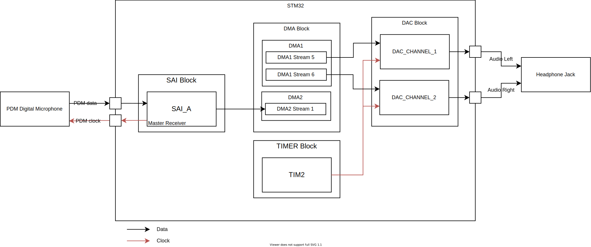

<h1> Direct Output </h1>

Ce Programme quand il est dans l'état `RECORDING` capte les sons ambiants via un microphone PDM, traite le le signal et joue sur les deux cannaux du DAC les son capté en temps réel

Peripheriques

# Machine d'état

