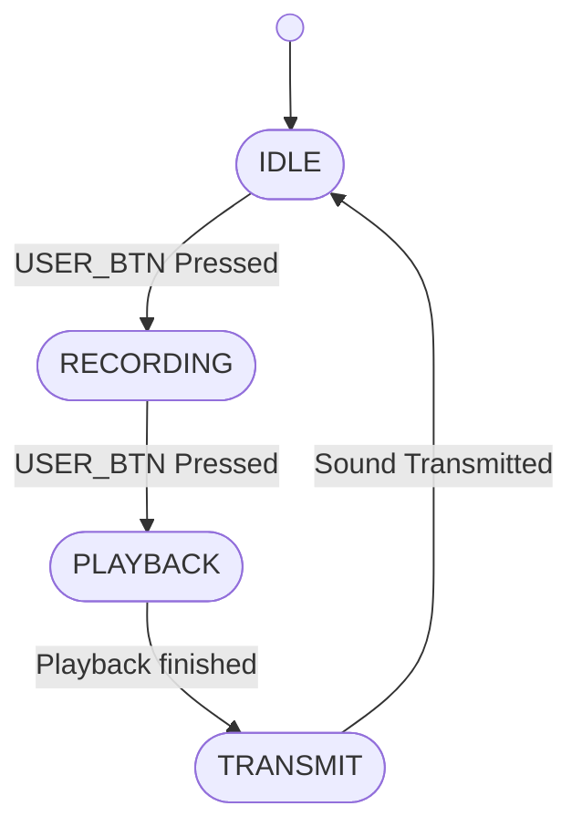

<h1> Parrot </h1>

# Machine d'état

```mermaid
graph TD
    INIT(( ));
    IDLE([IDLE]);
    RECORDING([RECORDING]);
    PLAYBACK([PLAYBACK])
    TRANSMIT([TRANSMIT])

    INIT --> IDLE;

    IDLE -->| USER_BTN Pressed | RECORDING;

    RECORDING -->| USER_BTN Pressed | PLAYBACK;

    PLAYBACK --> | Playback finished | TRANSMIT

    TRANSMIT -->| Sound Transmitted | IDLE;
```
