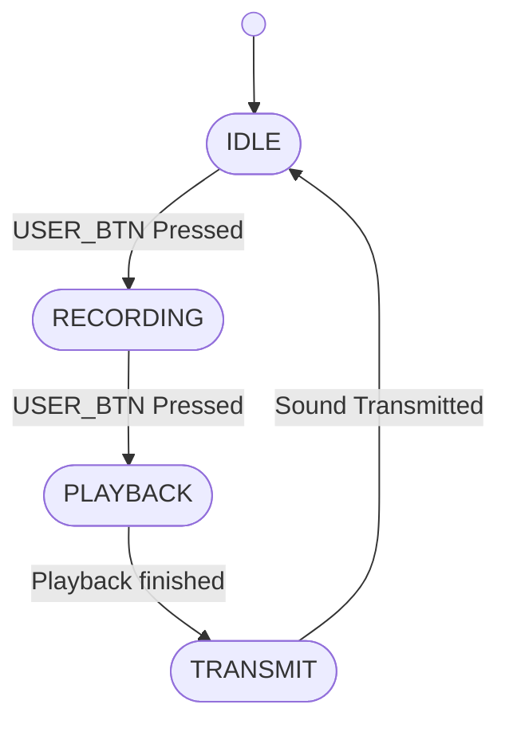
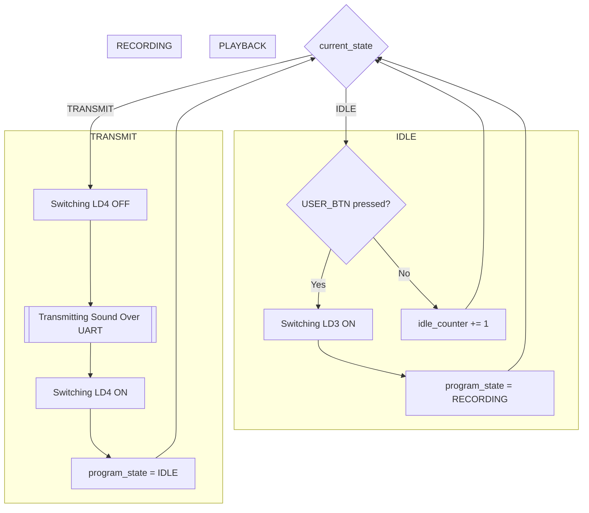

<h1> Parrot </h1>

Ce Programme lors d'un appui sur le bouton `USER` commence a enregistrer les sons ambitants puis lors d'un second appui il rejoue jusqu'a 3s sur le `DAC` un fois rejouer le son et ransmit au format WAVE sur une liaison série

<figure>
    
<figcaption style="text-align:center"><em>Peripherals Bock Diagram</em></figcaption>
</figure>

Ce Programme implemente la machine de 4 états suivante:

# Machine d'état

# Algortihme du Programme

