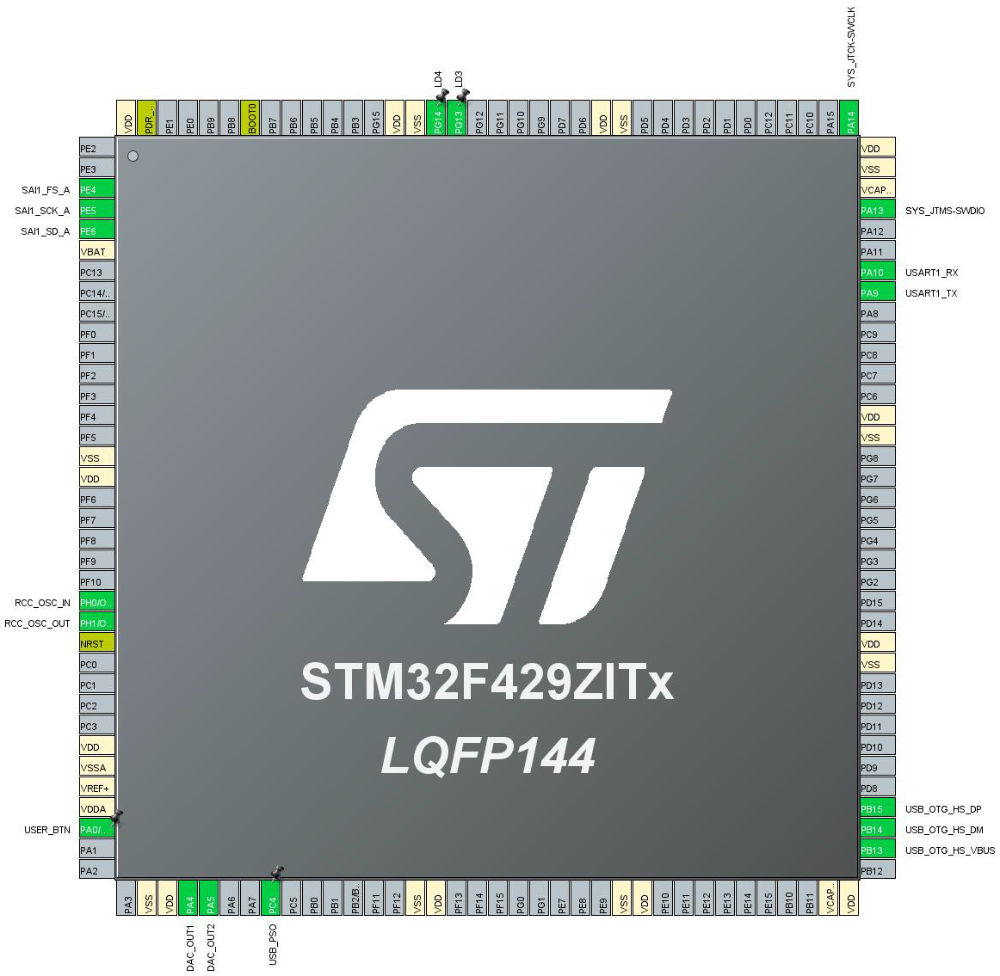

<h1> 03_Embedding</h1>

Ce dossier contient les sources des 3 démonstrateurs développées pour la cible STM32 (carte STM32F429I-DISC1). Ces démonstrateurs sont les suivants :
- [parrot](parrot/readme.md ): Application « Perroquet ». Lors de l’appui sur le bouton `USER` la carte commence l’enregistrement du son ambiant, lors d’un deuxième appui la carte rejoue jusqu’aux 3 dernières secondes sur le DAC puis elle transmet les données WAV via le port série.
- [Direct Output](direct_output/readme.md ): ce démonstrateur joue en temps réel sur le DAC les sons captés par la carte
- [Digital Recorder](digital_recoder/readme.md) : Ce démonstrateur lors de l’appui sur le bouton `USER` le démonstrateur enregistre les sons ambiants sur une clé USB lors d’un deuxième appui, il arrête l’enregistrement.

## Périphériques utilisés par les démonstrateurs

|                   |GPIO   | DAC   | RCC   | SAI 1 | SYS   | USART 1   | TIM 2 | USB_HS |
|:---               |:---:  |:---:  |:---:  |:-----:|:---:  |:-------:  |:-----:|:------:|
|Parrot             |X      |X      |X      |X      |X      |X          |X      |        |
|Direct Output      |X      |X      |X      |X      |X      |           |X      |        |
|Digital Recoder    |X      |       |X      |X      |X      |X          |       |X       |

## Configuration des Périphériques

### Pins utilisés par l’ensemble des Périphériques

<table>
	<thead>
		<tr>
			<th>PIN</th>
			<th>Signal</th>
			<th>Commentaire</th>
			<th>Péripherique</th>
		<tr>
	</thead>
	<tbody>
		<tr>
			<td>PA0</td>
			<td>USER_BUTTON</td>
			<td>Bouton Bleu de la carte</td>
			<td style="text-align: center; vertical-align: middle;" rowspan="3">GPIO</td>
		</tr>
		<tr>
			<td>PG13</td>
			<td>LD3</td>
			<td>LED Verte</td>
		</tr>
		<tr>
			<td>PG14</td>
			<td>LD4</td>
			<td>LED Rouge</td>
		<tr>
		<tr>
			<td>PA4</td>
			<td>DAC_OUT1</td>
			<td>Canal Gauche du DAC (Fil Rouge)</td>
			<td style="text-align: center; vertical-align: middle;" rowspan="2">DAC</td>
		</tr>
		<tr>
			<td>PA5</td>
			<td>DAC_OUT2</td>
			<td>Canal Droit du DAC (Fil Blanc)</td>
		</tr>
		<tr>
		<td>PH0</td>
			<td>RCC_OSC_IN</td>
			<td style="vertical-align: middle;" rowspan="2">Signaux de l'oscillateur</td>
			<td style="text-align: center; vertical-align: middle;" rowspan="2">RCC</td>
		</tr>
		<tr>
			<td>PH1</td>
			<td>RCC_OSC_OUT</td>
		</tr>
		<tr>
			<td>PE4</td>
			<td>SAI_FS_A</td>
			<td>SAI SELECT</td>
			<td style="text-align: center; vertical-align: middle;" rowspan="3">SAI 1</td>
		</tr>
		<tr>
			<td>PE5</td>
			<td>SAI_SCK_A</td>
			<td>SAI CLOCK</td>
		</tr>
		<tr>
			<td>PE6</td>
			<td>SAI_SD_A</td>
			<td>SAI DATA</td>
		</tr>
		<tr>
			<td>PA13</td>
			<td>SYS_JTMS-SWDIO</td>
			<td style="vertical-align: middle;" rowspan="2">Lignes de DEBUG</td>
			<td style="text-align: center; vertical-align: middle;" rowspan="2">SYS</td>
		</tr>
		<tr>
			<td>PA14</td>
			<td>SYS_JTCK-SWCLK</td>
		</tr>
		<tr>
			<td>PA9</td>
			<td>USART1_TX</td>
			<td>Canal TX de l'USART 1</td>
			<td style="text-align: center; vertical-align: middle;" rowspan="2">USART 1</td>
		</tr>
		<tr>
			<td>PA9</td>
			<td>USART1_RX</td>
			<td>Canal RX de l'USART 1</td>
		</tr>
		<tr>
			<td> PB13 </td>
			<td> USB_OTG_HS_VBUS </td>
			<td> Signal USB 2.0 VBUS</td>
			<td style="text-align: center; vertical-align: middle;" rowspan="4"> USB_HS </td>
		</tr>
		<tr>
			<td> PB14 </td>
			<td> USB_OTG_HS_DM</td>
			<td> Signal USB 2.0 D-</td>
		</tr>
		<tr>
			<td> PD15</td>
			<td> USB_OTG_HS_DP</td>
			<td> Signal USB 2.0 D+ </td>
		</tr>
		<tr>
			<td> PC4 </td>
			<td> USB_PSO </td>
			<td> Active l’alimentation du périphérique USB par la carte (0 &rarr; alimenté, 1 &rarr; Non alimenté)</td>
		</tr>
	</tbody>
</table>

Vue des pins activés sur le microcontrôleur :



### Configuration
#### Périphériques
##### System Core/GPIO
Pour configurer un Pin, il faut cliquer dessus dans la vue composant (`Pinout View`) puis sélectionner un type dans le menu contextuel :


###### MODE

N/A

###### Configuration

| Pin Name | Signal on Pin | PGIO output Level | GPIO Mode                                             | GPIO Pull-up/Pull-down      | Maximum Output Speed | User Label | Type            |
| -------- | ------------- | ----------------- | ----------------------------------------------------- | --------------------------- | :------------------: | ------------ | --------------- |
| PAO/WKUP | N/A           | N/A               | **External Event with Rising edge trigger detection** | No pull-up and no pull-down |         N/A          | **USER_BTN** | **GPIO_EXTIO**  |
| PC4      | N/A           | **Low**           | Output Push Pull                                      | No pull-up and no pull-down |         Low          | **USB_PSO**  | **GPIO_Output** |
| PG13     | N/A           | Low               | Output Push Pull                                      | No pull-up and no pull-down |         Low          | **LD3**      | **GPIO_Output** |
| PG14     | N/A           | Low               | Output Push Pull                                      | No pull-up and no pull-down |         Low          | **LD4**      | **GPIO_Output** |


##### System Core/RCC
###### MODE

| Clé                          | Valeur                          |
| ---------------------------- | ------------------------------- |
| High Speed Clock (HSE)       | **Crystal / Ceramic Resonator** |
| Low Speed Clock (LSE)        | Disable                         |
| Master Clock Output 1        | No                              |
| Master Clock Output 2        | No                              |
| Audio Clock Input (I2S_CKIN) | No                              |

###### Configuration

Par défaut


##### System Core/SYS

###### MODE

| Clé             | Valeur          |
| --------------- | --------------- |
| Debug           | **Serial Wire** |
| System Wake Up  | N/A             |
| Timebase Source | **TIM6**        |

###### Configuration

N/A

##### Analog/DAC
###### MODE

| Clé                | Valeur  |
| ------------------ | ------- |
| OUT1 Configuration | **Yes** |
| OUT2 Configuration | **Yes** |
| External Trigger   | No      |

###### Configuration

<table>
    <thead>
    	<tr>
        	<th>Clé</th>
            <th>Valeur</th>
        </tr>
    </thead>
    <tbody>
    	<tr>
        	<td style="text-align: center" colspan="2">DAC Out1 Settings</td>
        </tr>
        <tr>
        	<td>Output Buffer</td>
            <td>Enable</td>
        </tr>
        <tr>
        	<td>Trigger</td>
            <td style="font-weight: bolder;">Timer 2 Trigger Out event</td>
        </tr>
        <tr>
            <td>Wave Generation mode</td>
            <td>Disabled</td>
        </tr>
            	<tr>
        	<td style="text-align: center" colspan="2">DAC Out2 Settings</td>
        </tr>
        <tr>
        	<td>Output Buffer</td>
            <td>Enable</td>
        </tr>
        <tr>
        	<td>Trigger</td>
            <td style="font-weight: bolder;">Timer 2 Trigger Out event</td>
        </tr>
        <tr>
            <td>Wave Generation mode</td>
            <td>Disabled</td>
        </tr>
    </tbody>
</table>

###### DMA

| DMA Request | Stream       | Direction            | Priority | Mode         | Data Width    |
| ----------- | ------------ | -------------------- | -------- | ------------ | ------------- |
| **DAC1**    | DMA1 Stream5 | Memory to Peripheral | Low      | **Circular** | **Half Word** |
| **DAC2**    | DMA1 Stream6 | Memory to Peripheral | Low      | **Circular** | **Half Word** |

##### Timers/TIM2
###### MODE

| Clé                        | Valeur             |
| -------------------------- | ------------------ |
| Slave Mode                 | Disable            |
| Trigger Source             | Disable            |
| Clock Source               | **Internal Clock** |
| Channel1                   | Disable            |
| Channel2                   | Disable            |
| Channel3                   | Disable            |
| Channel4                   | Disable            |
| Combined Channels          | Disable            |
| Use ETR as Clearing Source | N/A                |
| XOR Activation             | N/A                |
| One Pulse Mode             | No                 |

###### Configuration

Pour déterminer la valeur de `Prescaler`($`PSC`$) et de `Counter Period ` ($`ARR`$) appliquer la formule suivante :

```math
(PSC + 1) * (ARR + 1) = \frac{f_{SYS}}{f_{TIM}}
```

Dans notre cas, les timers servent à produire un événement à $`F_{TIM}`$ à partir de la fréquence $`F_{SYS}`$ de l'horloge du système :


La valeur $`F_{TIM}`$ correspond à la fréquence de l'événement liée au remplissage du conteur lié au timer
La valeur $`F_{SYS}`$ correspond à la fréquence de l'horloge à l'entrée du timer (cf. [STM32F427xx STM32F429xx Datasheet](../00_Documentation/stm32f429zi.pdf) `Figure 4. STM32F427xx and STM32F429xx block diagram` page 20) dans notre cas `TIM2` est alimenté par l'horloge `APB1 Timer Clock`

Par exemple, pour obtenir $`f_{TIM} = 48 kHz`$ avec $`f_{SYS}=72 MHz`$ on configure $`PSC=0`$ et donc
```math
ARR=\frac{f_{SYS}}{f_{TIM}} - 1 = \frac{72 * 10^{6}}{48* 10{^3}} - 1 = 1499
```

<table>
    <thead>
    	<tr>
        	<th>Clé</th>
            <th>Valeur</th>
        </tr>
    </thead>
    <tbody>
    	<tr>
        	<td style="text-align: center" colspan="2">Counter Settings</td>
        </tr>
        <tr>
        	<td>Prescaler (PSC - 16 bits value)</td>
            <td>0</td>
        </tr>
        <tr>
        	<td>Counter Mode</td>
            <td>Up</td>
        </tr>
        <tr>
        	<td>Counter Period (AutoReload Register - 32 bits value)</td>
            <td><strong>1499</strong></td>
        </tr>
        <tr>
            <td>Internal Clock Division (CKD)</td>
            <td>No Division</td>
        </tr>
        <tr>
            <td>auto-reload preload</td>
            <td>Disable</td>
        </tr>
            	<tr>
        	<td style="text-align: center" colspan="2">Trigger Output (TGRO) Parameters</td>
        </tr>
        <tr>
        	<td>Master/Slave Mode (MSM Bit)</td>
            <td>Disable (Trigger input Effect not delayed)</td>
        </tr>
        <tr>
        	<td>Trigger Event Selection</td>
            <td ><strong>Update Event</strong></td>
        </tr>
    </tbody>
</table>

##### Connectivity/USART1

###### MODE

| Clé | Valeur |
|:----|:-------|
|Mode |**Asynchronous**|
|Hardware Flow Control (RS232) | Disable |

###### Configuration

<table>
    <thead>
    	<tr>
        	<th>Clé</th>
            <th>Valeur</th>
        </tr>
    </thead>
    <tbody>
        <tr>
        	<td style="text-align: center" colspan="2">Basic Parameters</td>
        </tr>
        <tr>
        	<td>Baud Rate</td>
            <td>115200 Bits/s</td>
        </tr>
        <tr>
        	<td>Word Length</td>
            <td >8 Bits (including Parity)</td>
        </tr>
        <tr>
        	<td>Parity</td>
            <td >None</td>
        </tr>
        <tr>
        	<td>Stop Bits</td>
            <td >1</td>
        </tr>
        <tr>
        	<td style="text-align: center" colspan="2">Advanced Settings</td>
        </tr>
        <tr>
            <td>Data Direction</td>
            <td>Receive and Transmit</td>
        </tr>
		<tr>
			<td>Over Sampling</td>
			<td>16 Samples</td>
		</tr>
    </tbody>
</table>

##### Connectivity/USB_OTG_HS
###### MODE

| Clé | Valeur |
|:----|:-------|
|<span style="color:gray">*External Phy*</span> | <span style="color:gray">*Disable*</span> |
|Internal FS Phy | **Host_Only**|
|<div style="background-color:crimson;color:white">Activate_SOF</div> | No
|Activate_VBUS | **Yes**|

###### Configuration
| Clé | Valeur |
|:----|:-------|
|Speed | Host Full Speed (12MBits/s) |
|Enable Internal IP DMA| Disable|
| Physical Interface | Internal Phy |
|Signal Start of frame | Disable |

##### Multimedia/SAI
###### MODE

| Clé        | Valeur     |
| ---------- | ---------- |
| SAI_A Mode | **Master** |
| SAI_B Mode | Disable    |


###### Configuration

<table>
    <thead>
    	<tr>
        	<th>Clé</th>
            <th>Valeur</th>
        </tr>
    </thead>
    <tbody>
    	<tr>
        	<td style="text-align: center" colspan="2">SAI A</td>
        </tr>
        <tr>
        	<td style="text-align: center" colspan="2">Basic Parameters</td>
        </tr>
        <tr>
        	<td>Protocol</td>
            <td>Free</td>
        </tr>
        <tr>
        	<td>Audio Mode</td>
            <td ><strong>Master Receive</strong></td>
        </tr>
        <tr>
        	<td>Frame Length (only Even Values)</td>
            <td><strong>64 Bits</strong></td>
        </tr>
        <tr>
        	<td>Data Size</td>
            <td><strong>16 Bits</strong></td>
        </tr>
        <tr>
            <td>Slot Size</td>
            <td>DataSize</td>
        </tr>
        <tr>
        	<td style="text-align: center" colspan="2">Frame Parameters</td>
        </tr>
        <tr>
            <td>First Bit</td>
            <td>MSB First</td>
        </tr>
        <tr>
        	<td>Frame Synchro Active Level Length</td>
            <td><strong>32</strong></td>
        </tr>
        <tr>
        	<td>Frame Synchro Definition</td>
            <td><strong>Channel Identification</strong></td>
        </tr>
        <tr>
        	<td>Frame Synchro Polarity</td>
            <td>Active Low</td>
        </tr>
        <tr>
        	<td>Frame Synchro Offset</td>
            <td>First Bit</td>
        </tr>
        <tr>
        	<td style="text-align: center" colspan="2">Slot Parameters</td>
        </tr>
        <tr>
        	<td>First Bit Offset</td>
            <td>0</td>
        </tr>
        <tr>
        	<td>Number of Slots (Only Even Values)</td>
            <td><strong>4</strong></td>
        </tr>
        <tr>
        	<td>Slot Active Final Value</td>
            <td><em>0x000FFFF</em></td>
        </tr>
        <tr>
        	<td>Slot Active </td>
            <td><strong>All</strong></td>
        </tr>
        <tr>
        	<td style="text-align: center" colspan="2">Clock Parameters</td>
        </tr>
        <tr>
        	<td>Clock Source</td>
            <td><em>SAI PLL Clock</em></td>
        </tr>
        <tr>
        	<td>Master Clock Divider</td>
            <td><strong>Disable</strong></td>
        </tr>
        <tr>
        	<td>Real Audio Frequency</td>
            <td><em>48.0 kHz<em></td>
        </tr>
        <tr>
        	<td>Error Between Selected</td>
            <td><em>-65.5%</em></td>
        </tr>
        <tr>
        	<td>Clock Strobing</td>
            <td><strong>Rizing Edge</strong></td>
        </tr>
        <tr>
        	<td style="text-align: center" colspan="2">Advanced Parameters</td>
        </tr>
        <tr>
        	<td>FIFO Threshold</td>
            <td>Empty</td>
        </tr>
        <tr>
        	<td>Output Drive</td>
            <td>Disabled</td>
        </tr>
    </tbody>
</table>


###### DMA

| DMA Request | Stream       | Direction            | Priority | Mode         | Data Width    |
| ----------- | ------------ | -------------------- | -------- | ------------ | ------------- |
| **SAI1_A**  | DMA2 Stream1 | Peripheral to Memory | Low      | **Circular** | **Half Word** |


##### Middleware/FATFS
###### Mode
| Clé | Valeur |
|:----|:-------|
|<span style="color:gray">*External SDRAM*</span> | <span style="color:gray">*No*</span> |
|<span style="color:gray">*External SRAM*</span> | <span style="color:gray">*No*</span> |
|<span style="color:gray">*SD Card*</span> | <span style="color:gray">*No*</span> |
|USB Disk| **Yes** |
|User-Defined| No |

###### Mode

<table>
	<thead>
		<tr>
			<th> Clé </th>
			<th> Valeur </th>
		</tr>
	</thead>
	<tbody>
		<tr>
			<td style="text-align: center" colspan="2"> Version </td>
		</tr>
		<tr>
			<td style="color:grey;"> FATFS Version </td>
			<td style="color:grey"> R0.12c</td>
		</tr>
		<tr>
			<td style="text-align: center" colspan="2"> Function Parameters </td>
		</tr>
		<tr>
			<td> FS_READONLY (Read-only mode) </td>
			<td> Disabled</td>
		</tr>
		<tr>
			<td> FS_MINIMIZE (Minimization level) </td>
			<td> Disabled</td>
		</tr>
		<tr>
			<td> USE_STRFUNC (String functions) </td>
			<td> Enabled with LF->CRLF conversion</td>
		</tr>
		<tr>
			<td> USE_FIND (Find functions) </td>
			<td> Disabled </td>
		</tr>
		<tr>
			<td> USE_MKFS (Make filesystem functions) </td>
			<td> Enabled </td>
		</tr>
		<tr>
			<td> USE_FASTSEEK (Fast seek functions) </td>
			<td> Enabled </td>
		</tr>
		<tr>
			<td> USE_EXPAND (f_expend functions) </td>
			<td> Disabled </td>
		</tr>
		<tr>
			<td> USE_CHMOD (Change attributes functions) </td>
			<td> Disabled </td>
		</tr>
		<tr>
			<td> USE_LABEL (Volume label functions) </td>
			<td> Disabled </td>
		</tr>
		<tr>
			<td> USE_FORWARD (Forward functions) </td>
			<td> Disabled </td>
		</tr>
		<tr>
			<td style="text-align: center" colspan="2"> Local and Namespace Parameters </td>
		</tr>
		<tr>
			<td> CODE_PAGE (Code page on target) </td>
			<td> Latin 1</td>
		</tr>
		<tr>
			<td>USE_LFN (Use Long Filename)</td>
			<td><strong>Enabled with static working buffer on the BSS</strong></td>
		</tr>
		<tr>
			<td>MAX_LFN (Max Long Filename)</td>
			<td><strong>255</strong></td>
		</tr>
		<tr>
			<td>LFN_UNICODE (Enable Unicode)</td>
			<td>ANSI/OEM</td>
		</tr>
		<tr>
			<td>STRF_ENCODE (Character encoding)</td>
			<td>UTF-8</td>
		</tr>
		<tr>
			<td>FS_RPATH (Relative Path)</td>
			<td>Disabled</td>
		</tr>
		<tr>
			<td style="text-align: center" colspan="2"> Physical Drive Parameters </td>
		</tr>
		<tr>
			<td>VOLUMES (Logical drives)</td>
			<td>1</td>
		</tr>
		<tr>
			<td>MAX_SS (Maximum Sector Size)</td>
			<td><strong>4096</strong></td>
		</tr>
		<tr>
			<td>MIN_SS (Minimum Sector Size)</td>
			<td>512</td>
		</tr>
		<tr>
			<td>MULTI_PARTITION (Volume partitions feature)</td>
			<td>Disabled</td>
		</tr>
		<tr>
			<td>USE_TRIM (Erase feature)</td>
			<td>Disabled</td>
		</tr>
		<tr>
			<td>FS_NOFSINFO (Force full FAT Scan)</td>
			<td>0</td>
		</tr>
		<tr>
			<td style="text-align: center" colspan="2"> System Parameters </td>
		</tr>
		<tr>
			<td>FS_TINY (Tiny mode)</td>
			<td>Disabled</td>
		</tr>
		<tr>
			<td>FS_EXFAT (Support of exFAT file system)</td>
			<td><strong>Enabled</strong></td>
		</tr>
		<tr>
			<td>FS_NORTC (Timestamp Feature)</td>
			<td>Dynamic timestamp</td>
		</tr>
		<tr>
			<td>FS_REENTRANT (Re-Entrancy)</td>
			<td>Disabled</td>
		</tr>
		<tr>
			<td>FS_TIMEOUT (Timeout ticks)</td>
			<td>1000</td>
		</tr>
		<tr>
			<td>FS_LOCK (Number of files opened simultaneously)</td>
			<td>2</td>
		</tr>
	</tbody>

</table>


##### Middleware/USB_HOST
###### Mode
| Clé | Valeur |
|:----|:-------|
|Class For HS IP | **Mass Storage Host Class** |
|<span style="color:gray">*Class For HS IP*</span> | <span style="color:gray">*Disable*</span> |


###### Mode

<table>
	<thead>
		<tr>
			<th> Clé </th>
			<th> Valeur </th>
		</tr>
	</thead>
	<tbody>
		<tr>
			<td style="text-align:center" colspan="2"> Host Configuration </td>
		</tr>
		<tr>
			<td> USBH_MAX_NUM_ENDPOINTS (Maximum number of endpoints) </td>
			<td> 2</td>
		</tr>
		<tr>
			<td> USBH_MAX_NUM_INTERFACES (Maximun number of interfaces)</td>
			<td> 2 </td>
		</tr>
		<tr>
			<td>USBH_MAX_NUM_SUPPORTED_CLASS (Maximun number of supported class)</td>
			<td> 1 </td>
		</tr>
		<tr>
			<td>USBH_MAX_NUM_CONFIGURATION (Maximun number of supported configuration)</td>
			<td> 1 </td>
		</tr>
		<tr>
			<td>USBH_KEEP_CFG_DESCRIPTOR (Keep the configuration into RAM)</td>
			<td> Enabled </td>
		</tr>
		<tr>
			<td>USBH_MAX_SIZE_CONFIGURATION (Maximun size in bytes for the Configuration Descriptor)</td>
			<td> 256 Byte(s)</td>
		</tr>
		<tr>
			<td>USBH_MAX_DATA_BUFFER (Maximun size of temporary data)</td>
			<td>512 Byte(s)</td>
		</tr>
		<tr>
			<td>USBH_DEBUG_LEVEL (USBH Debug Level)</td>
			<td>0. No debug message</td>
		</tr>
		<tr>
			<td style="text-align:center" colspan="2"> CMSIS_RTOS </td>
		</tr>
		<tr>
			<td>USBH_USE_OS (Enable the support of an RTOS) </td>
			<td>Disabled</td>
		</tr>
	</tbody>
</table>

###### Platform Settings

|Name          |IPs or Components| Found Solution   | I2C Addr | BSP API |
|:-------------|:----------------|:-----------------|:---------|:--------|
|Drive_VBUS_HS | **GPIO:Output** |**PC4 [USB_PSO]** | *N/A*    |*Unknown*|


#### Horloges
Pour configurer les Holorges, il faut définir plusieurs fréquences que l'on utilise sur la carte :
- `SAI-A clock (MHz)` Corresponds à la fréquence d'échantillonnage du signal PDM ($`fs_{PDM}`$) pour la déterminer :
Avec $`D`$ le facteur de décimation (multiple de 16) et $`fs_{PCM}`$ la fréquence d'échantillonnage recherché pour le signal PCM.
```math
fs_{PDM} = D * fs_{PCM}
```

- `48 MHz Clocks (MHz)` Corresponds à une horloge cadencée à 48 MHz utilisés par l'interface USB

- `HCLK (MHz)` Corresponds à l'horloge système, elle influe directement sur les horloges`APBx Timer Clocks`, pour l'utilisation de `TIM2` c'est l'horloge `APB2 timer clocks` qui nous intéresse.

Pour mieux comprendre, prenons l'exemple; suivant :
- `SAI-A clock (MHz)` :
```math
fs_{PDM} = D * fs_{PCM} = 64 * 48 * 10^3 = 3.072 * 10^6
```
on configurera donc `SAI-A Clock` a 3.072 MHz

- `48 MHz Clock` sera configuré à 48 MHz

- `HCLK` sera configuré à 72 MHz

Ce qui nous donne le schéma d'horloges suivant :


