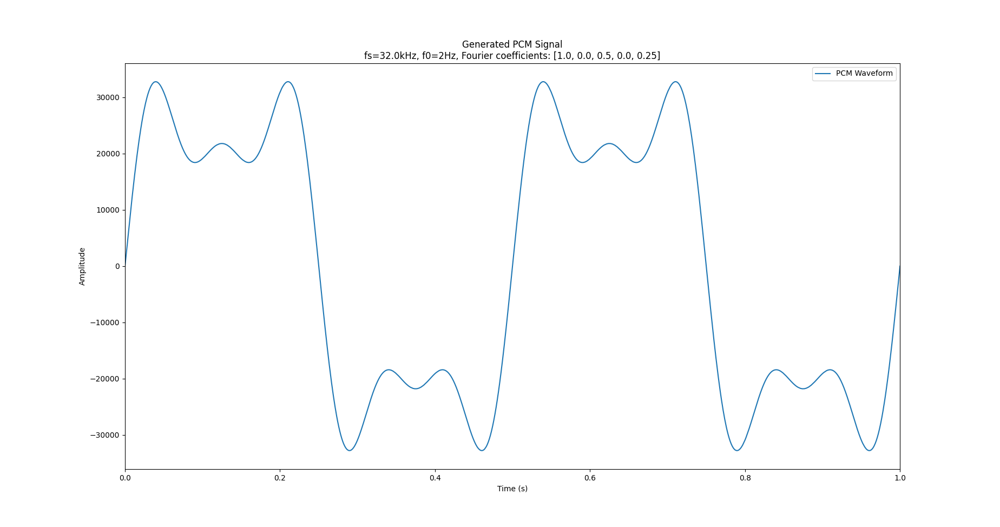
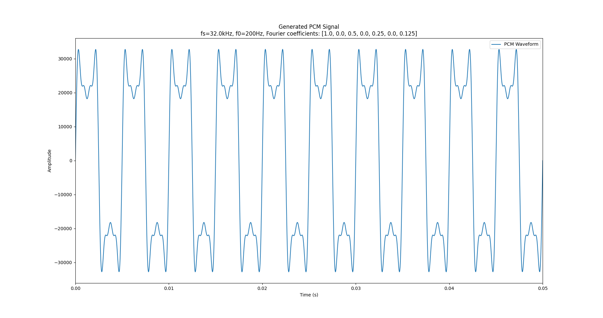
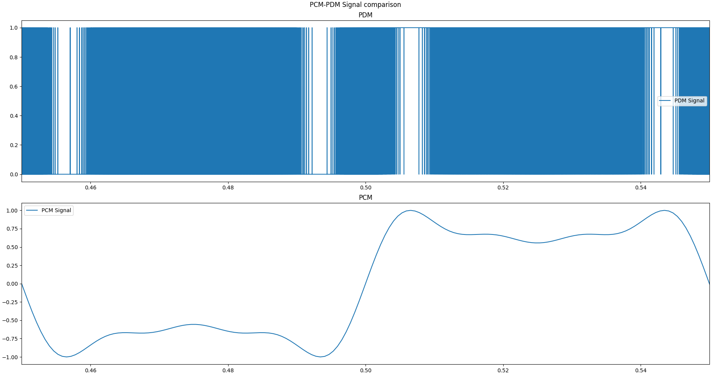
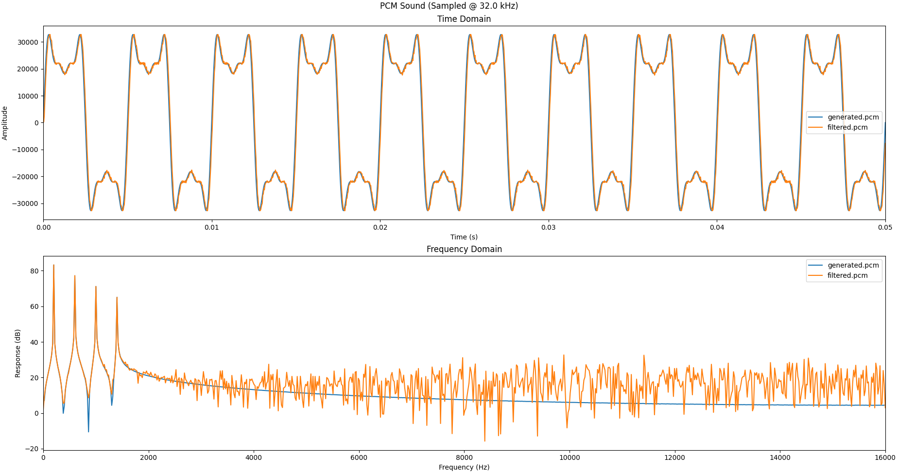

# STM32PDM

Traitement de signal audio embarqué temps-réel sur carte STM32


## Contenu du dépôt

### 00_Documentation

Dossier contenant la documentation relative à la réalisation du projet (Carte Cible, µ-Controlleur, Exemples...)

### 01_PCM_PDM_Toolbox

Dossier contenant divers scripts Python pour les conversions PCM PDM WAV

#### pcm2pdm.py

Script pour convertir un Signal PCM en Signal PDM

Message d'aide:

```
usage: pcm2pdm [-h] [-f FACTOR] <Input file> <Output file>

Python script to convert PCM to PDM

positional arguments:
  <Input file>          PCM input file
  <Output file>         PDM output file

optional arguments:
  -h, --help            show this help message and exit
  -f FACTOR, --factor FACTOR
                        (PDM fs / PCM fs) factor
```

#### pcm2plot.py

Script pour tracer les composantes temporelles et fréquentielles de signaux PCM

Message d'aide:

 ```
 usage: pcm2wav [-h] [-s SAMPLING] <Input file> [<Input file> ...]
 
 Python script to Plot PCM Files
 
 positional arguments:
   <Input file>          PCM file to convert
 
 optional arguments:
   -h, --help            show this help message and exit
   -s SAMPLING, --sampling SAMPLING
                         Sampling Frequency
 ```


#### pcm2wav.py

Script pour convertir un signal PCM en fichier WAV

Message d'aide:

```
usage: pcm2wav [-h] [-s SAMPLING] <Input file> <Output file>

Python script to convert PCM Files to WAV

positional arguments:
  <Input file>          PCM file to convert
  <Output file>         WAV output file

optional arguments:
  -h, --help            show this help message and exit
  -s SAMPLING, --sampling SAMPLING
                        Audio Sampling Frequency
```

#### pcm_generator.py

Script pour générer des signaux PCM

Message d'aide:

```
usage: pcm_generator [-h] [-s SAMPLING] [-f0 F0] [-t TIME] [-c COEFFS [COEFFS ...]] <Output file>

Python Script to generate PCM waveforms

positional arguments:
  <Output file>         PCM output file

optional arguments:
  -h, --help            show this help message and exit
  -s SAMPLING, --sampling SAMPLING
                        PCM Sampling frequency
  -f0 F0                Fundamental Frequency of the signal
  -t TIME, --time TIME  Signal Duration
  -c COEFFS [COEFFS ...], --coeffs COEFFS [COEFFS ...]
                        Fourier Coefficients
```

Exemple de signal généré:



### 02_Capturing

Dossier contenant les scripts Python utlisés pour la capture des données envoyées par la carte sur le port série

#### serial_capture.py

Fichier Python de "librairie" utilisé pour la capture de données sur le port série

Fonctions exposées:

```Python
def serial_capture(com_port:str, speed:int, timeout_s:float):
    """
    Function to capture Data from the serial Port

    Parameters
    ----------
    com_port : str
        Serial Port to listen
    speed: int
        Serial Communication Speed in Bauds
    timeout_s: float
        Time in seconds after last byte received to end the communication

    Returns
    -------
    list
        list of the bytes received
    """
    ...
```

#### pcm_capture.py

Script Python exportant les données capturées sur le port série dans un fichier PCM

Message d'aide:

```
usage: pcm_capture.py [-h] [-b baud] <PCM OUTPUT FILE> <COM PORT>

Python Script to capture PCM data From Serial Port

positional arguments:
  <PCM OUTPUT FILE>  PCM File where the captured data will be stored
  <COM PORT>         COM PORT to capture from

optional arguments:
  -h, --help         show this help message and exit
  -b baud            Serial Port Speed in Baud (defaults @115200 Baud)
```

#### wav_capture.py

Script python exportant les données capturées sur le port série dans un fichier WAV

Message d'aide:

```
usage: pcm_capture.py [-h] [-b baud] [-s SAMPLING] <PCM OUTPUT FILE> <COM PORT>

Python Script to capture WAV data From Serial Port

positional arguments:
  <PCM OUTPUT FILE>     PCM File where the captured data will be stored
  <COM PORT>            COM PORT to capture from

optional arguments:
  -h, --help            show this help message and exit
  -b baud               Serial Port Speed in Baud (defaults @115200 Baud)
  -s SAMPLING, --sampling SAMPLING
                        Sampling Frequency
```

### 03_Filtering

Dossier contenant le programme C utilisant la même libraire que celle embarqué pour le filtrage PDM dasn la carte cible

#### Compilation

```bash
cd 03_Filtering
mkdir build && cd build
cmake ..
make -j${nproc}
```

#### Message d'aide

```
PDM Filter v0.0.1
USAGE: ./pdm_filter [-h] [-f FACTOR] <Input File> <Outpufile>
C Program to filter PDM Signals to PCM format

Positional arguments:
    <Input File>        PDM Signal file
    <Output File>       PCM output file

Optional arguments:
    -h                  Show this help message
    -f FACTOR           Decimation Factor of the filter
```

### 04_Embeddeding

TODO


## Exemple Chaine PCM&rarr;PDM&rarr;PCM

### Etape 1 : Génération d'un signal PCM

Dans cet exemple on va générer un signal pseudo-caré de fréquence 200Hz echantionné à 32kHz pendant 50 ms

```bash
# terminal located in repository root folder
virturalenv venv  # creating Python virtual environement
source venv/bin/activate
pip install -r requirements.txt # install Python modules required
python 01_PCM_PDM_Toolbox/pcm_generator.py generated.pcm -s 32000 -f0 200 -t .05 -c 1 0 .5 0 .25 0 .125
# Window showing genrated PCM signal
deactivate
```

On obtiendra la figure suivante traçant le signal dans le temps



### Etape 2 : Convertion du signal PCM en PDM


```bash
# terminal located in repository root folder
source venv/bin/activate
python 01_PCM_PDM_Toolbox/pcm2pdm.py generated.pcm generated.pdm -f 64
# Window showing PCM and PDM Signals
deactivate
```

On obtiendra la figure suivante traçant les signaux PCM et PDM



### Etape 3 : Filtrage du signal PDM

Pour filtrer le signal PCM on utilise le prgramme C fourni dans le dossier [03_filtering](##03_filtering)

```bash
# terminal located in repository root folder
make -C 03_Filtering/build
./03_Filtering/build/pdm_filter -f 64 generated.pdm filtered.pcm

```

### Etape 4: Comparaison du PCM Original de celui obtenue par la chaine PCM&rarr;PDM&rarr;PCM

```bash
# terminal located in repository root folder
source venv/bin/activate
python 01_PCM_PDM_Toolbox/pcm2plot.py generated.pcm filtered.pcm
# Window showing PCM and PDM Signals
deactivate
```

On obtiens alors les figures suivantes:



## Etude de la reponse du filtre

TODO 


## Architecture Embarquée

TODO
